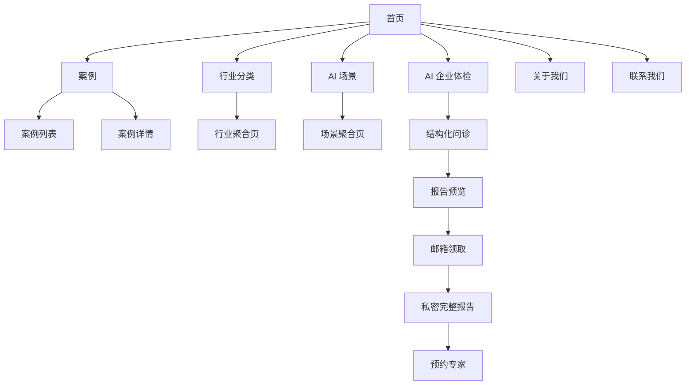

# 01 产品总览

## 1. 目标

本章定义 AI案例库 V1.0 的产品定位、目标用户、核心问题、MVP 范围、用户旅程、成功指标和上线边界，作为其他分册的共同依据。

## 2. 产品定位

### 2.1 一句话介绍

> 企业 AI 改造，从案例开始。

### 2.2 产品定义

AI案例库是中国企业 AI 改造案例数据库。它通过可信、可检索、格式统一的案例，帮助企业完成“看案例 → 找方向 → 做 AI”的早期决策。

### 2.3 不是什么

- 不是面向所有问题的通用 AI 聊天机器人；
- 不是 Agent 编排或开发平台；
- 不是 AI 社区或资讯门户；
- V1 不是实施商交易平台；
- V1 不承诺直接完成企业数字化改造。

## 3. 用户与需求

### 3.1 主要用户：企业老板

| 维度 | 描述 |
| --- | --- |
| 背景 | 对 AI 有兴趣但缺少系统认知，时间有限 |
| 核心问题 | 不知道 AI 能做什么、不知道同行怎么做、不知道先做哪里 |
| 决策关注 | ROI、投入、周期、风险、是否已有成功先例 |
| 内容偏好 | 结论先行、少技术术语、能快速判断是否与自身相似 |
| 成功体验 | 5 分钟内找到相似案例并形成下一步方向 |

### 3.2 次级用户：企业信息化负责人

| 维度 | 描述 |
| --- | --- |
| 背景 | 负责 ERP、CRM、MES、OA 或系统集成 |
| 核心问题 | 需要向管理层证明项目价值并评估落地条件 |
| 决策关注 | 数据基础、系统接口、实施周期、供应商和风险 |
| 成功体验 | 能找到同类系统和场景的实施经验，形成内部立项依据 |

### 3.3 后期用户

AI 实施公司和独立开发者属于后期供给侧用户。V1 仅允许平台编辑公开实施方信息，不开放入驻、投稿、自助获客或付费推广。

## 4. 需要解决的问题

| 问题 | V1 对应能力 |
| --- | --- |
| 不知道 AI 能做什么 | 按行业、场景和业务问题浏览案例 |
| 不知道同行怎么做 | 展示企业规模、背景、问题、方案、周期与效果 |
| 不知道信息是否可信 | 展示来源、采集时间、可信度和“事实/判断”边界 |
| 不知道优先改造哪里 | 免费 AI 企业体检给出分阶段优先级 |
| 不知道投入和回报 | 展示来源披露数据或带假设的 AI 经验区间 |
| 不知道下一步找谁 | 允许用户主动预约平台专家进行人工回访 |

## 5. 产品目标与成功标准

### 5.1 三个月目标

1. 验证企业用户是否愿意深度阅读结构化案例。
2. 验证搜索和分类是否能帮助用户找到相似案例。
3. 验证免费体检能否从案例阅读自然承接需求。
4. 验证用户是否愿意为完整报告提供邮箱，并主动预约专家。

### 5.2 指标层级

| 层级 | 指标 | 口径 |
| --- | --- | --- |
| 北极星 | 有效案例阅读人数 | 30 秒有效停留且阅读深度达到 50% 的去重访客 |
| 获客 | 自然搜索独立访客 | 来源为自然搜索的去重匿名访客 |
| 发现 | 搜索成功率 | 返回至少 1 条结果的搜索次数 / 总搜索次数 |
| 内容 | 案例有效阅读率 | 有效阅读次数 / 案例详情访问次数 |
| 体检 | 体检开始率 | 开始体检人数 / 有效案例读者人数 |
| 体检 | 体检完成率 | 生成报告预览人数 / 开始体检人数 |
| 留资 | 邮箱提交率 | 成功提交邮箱人数 / 查看报告预览人数 |
| 线索 | 专家预约率 | 成功预约人数 / 完整报告查看人数 |

V1 不设虚假的流量或转化目标值。上线后以前两周数据建立基线，第三周开始按周观察趋势。

## 6. MVP 范围

### 6.1 必须上线

- 首页及全站导航；
- 案例列表、案例详情和相关案例；
- 关键词搜索、行业/规模/场景/结果筛选；
- 行业和 AI 场景聚合页；
- AI 企业体检、报告预览、邮箱领取完整报告；
- 私密报告查看、删除和专家预约；
- 关于我们、联系我们、隐私政策和使用条款；
- 单管理员登录；
- 案例单篇新增、编辑、归档和删除；
- CSV/XLSX 批量导入、AI 结构化、去重、审核和发布；
- 来源、企业别名、分类、场景词表和可信度管理；
- SEO 基础能力、埋点和关键运营看板。

### 6.2 明确不做

- 普通用户登录注册；
- 评论、点赞、收藏、关注和社区；
- 支付、会员、订阅；
- AI Marketplace；
- 实施商入驻、企业认证和自助投稿；
- APP、小程序；
- 自动爬虫和定时采集；
- 多管理员角色体系；
- 直接撮合交易和在线签约。

## 7. 信息架构

## 8. 核心用户旅程

### 8.1 搜索案例

1. 用户从搜索引擎进入案例详情或行业聚合页。
2. 用户确认企业、行业、规模和问题是否与自身相似。
3. 用户阅读方案、实施周期、效果、来源和编辑点评。
4. 用户查看同类案例或调整筛选条件。
5. 用户开始 AI 企业体检，或通过分享链接转发案例。

### 8.2 主动体检

1. 用户从导航或案例 CTA 进入体检介绍页。
2. 用户确认隐私和 AI 使用提示并开始问诊。
3. 系统收集结构化信息并根据答案动态追问。
4. 系统生成改造优先级、路线图和 ROI 经验区间预览。
5. 用户填写邮箱，收到私密完整报告链接。
6. 用户可调整 ROI 假设、删除报告或预约专家。

### 8.3 内容运营

1. 管理员准备 CSV/XLSX 或单篇来源材料。
2. 系统保存原始记录，执行精确和语义去重。
3. AI 抽取结构化字段并生成编辑点评草稿。
4. 管理员处理企业归一、疑似重复和事实核验。
5. 管理员预览并发布，前台及搜索索引更新。

## 9. 全局业务原则

1. 事实、AI 总结和编辑判断必须在数据和界面上可区分。
2. AI 不能补造来源没有披露的数字或事实。
3. 发布案例必须至少关联一个可识别来源。
4. 同一项目的多个来源合并到同一案例，而不是形成重复案例。
5. 未经人工审核的采集内容和 AI 输出不得出现在公开页面。
6. 任何页面都不得暗示平台保证 AI 项目的实际效果。
7. 普通用户无需登录即可浏览案例和完成体检。
8. 涉及个人信息的动作必须在提交前提供清晰用途说明。

## 10. 依赖与约束

- 首发内容依赖 100–200 条人工抽查案例及其有效来源链接。
- 体检质量依赖问诊模板、行业场景词表和 ROI 基准的持续维护。
- Vercel、MongoDB Atlas 和第三方模型在中国大陆的访问质量必须实测。
- 邮件是完整报告的主要交付通道，发送稳定性直接影响转化。
- 公开来源的版权、链接失效和事实变化需要持续治理。

## 11. 风险与应对

| 风险 | 应对措施 |
| --- | --- |
| 案例看起来像厂商广告 | 展示多来源、可信度、失败案例和编辑点评 |
| AI 生成错误数字 | 数字字段必须关联来源或明确标识估算与假设 |
| 泛行业导致内容稀疏 | 底层保留完整分类，前台只突出有内容的行业 |
| 搜索结果重复 | 实体归一、多层去重和人工复核 |
| 体检过长导致流失 | 关键问题优先、显示进度、允许保存当前会话 |
| 邮件无法送达 | 邮箱校验、发送重试、页面保留一次性访问入口 |
| 大陆访问不稳定 | 上线前多地区实测，架构保留 MongoDB 兼容的国内部署迁移边界 |
| 失败案例产生争议 | 严格来源门槛、客观措辞、申诉和更正机制 |

## 12. 上线门槛

- 至少 100 条案例完成发布前人工核验；
- 每条案例至少有一个有效来源，数字类关键结论可追溯；
- 首页重点行业和重点场景均有可浏览案例；
- 搜索、筛选、体检、邮件、报告删除和预约全链路通过验收；
- 隐私政策、内容声明、AI 生成提示和联系方式公开可访问；
- 关键埋点可以在分析工具中验证；
- 中国大陆至少三个不同网络环境完成可用性实测；
- 严重级和高优先级缺陷清零。

## 13. 验收标准

1. 用户无需登录即可完成案例发现、阅读和体检预览。
2. 用户能够在三步内从首页进入任一已发布案例详情。
3. 案例详情能够清楚区分来源事实、AI 摘要和编辑判断。
4. 搜索和筛选结果仅包含已发布、未删除案例。
5. 完整报告必须通过有效邮箱生成，并可由用户主动删除。
6. 所有明确排除功能在前台和后台均不存在误导入口。
