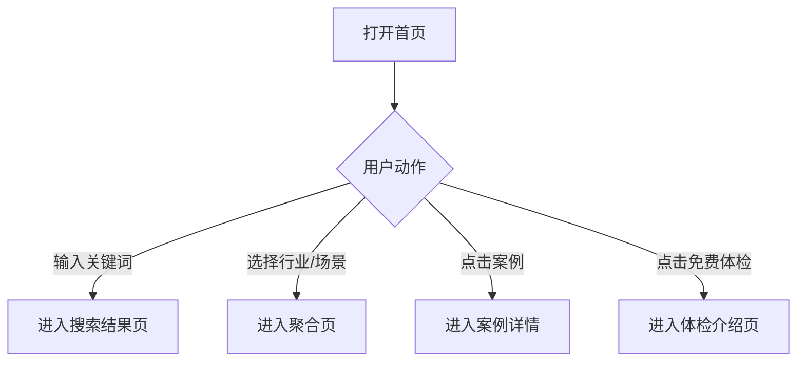
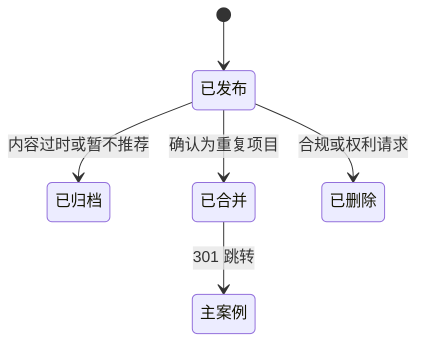

# 02 前台产品需求

## 1. 目标

让企业用户无需学习成本即可发现、筛选和判断与自身相似的 AI 案例，并自然进入 AI 企业体检。前台强调简单、干净、专业、科技感和大量留白，不使用炫技动画或复杂背景。

## 2. 参与者与前置条件

### 2.1 参与者

- 匿名企业用户；
- 从搜索引擎进入的内容读者；
- 已获得私密报告链接的体检用户；
- 搜索引擎爬虫。

### 2.2 前置条件

- 案例已通过后台审核并处于“已发布”；
- 分类和场景处于启用状态；
- 页面仅读取公开字段，不暴露原始采集内容或后台备注；
- 全站支持桌面端和移动端。

## 3. 全站框架

### 3.1 顶部导航

固定入口：Logo/首页、AI 案例、行业、AI 场景、AI 企业体检、关于我们。右侧主按钮为“免费 AI 体检”。移动端折叠为菜单，但搜索和体检入口必须保持可见。

### 3.2 页脚

包含产品一句话介绍、案例/行业/场景入口、关于我们、联系我们、隐私政策、使用条款、内容更正入口、备案信息占位和版权信息。

### 3.3 全局状态

- 加载：使用稳定骨架屏，不改变主要布局；
- 空结果：解释原因并提供清除筛选、热门案例和开始体检入口；
- 服务异常：保留当前查询条件，提供重试；
- 404：提供搜索框和热门案例；
- 维护：案例浏览可用时不得因体检服务异常而全站不可用。

## 4. 首页

### 4.1 页面目标

用户在首屏内理解产品是什么，并能立即搜索或进入热门分类；首屏不介绍团队、技术栈或商业模式。

### 4.2 页面结构

1. 主标题：AI案例库。
2. 副标题：中国企业 AI 改造案例数据库。
3. 已发布案例数量，必须来自实时统计，不使用写死数字。
4. 主搜索框，提示示例为“搜索行业、企业或业务问题，例如：报价、客服、OCR”。
5. 热门行业和热门场景快捷入口。
6. 最新/精选案例流。
7. 按业务问题发现案例。
8. AI 企业体检介绍和 CTA。
9. 可信内容说明：来源可追溯、AI 与事实分离、成功失败均收录。

### 4.3 主流程

### 4.4 业务规则

- 热门标签由后台设置排序；未设置时按近 30 天有效阅读人数排序。
- 精选案例优先展示后台人工精选，其次按发布时间倒序补齐。
- 案例总数仅统计“已发布”且未软删除的案例。
- 搜索框提交空字符串时不发起搜索，显示热门搜索建议。
- 首页案例卡片不展示来源未披露的空数字，不用 `0` 代替。

### 4.5 首页埋点

`home_view`、`home_search_submit`、`home_taxonomy_click`、`home_case_click`、`home_assessment_click`。

## 5. 案例列表与搜索结果

### 5.1 页面目标

支持用户通过关键词和组合条件快速缩小范围，并理解为什么某案例被返回。

### 5.2 筛选项

| 筛选项 | 形式 | 规则 |
| --- | --- | --- |
| 关键词 | 输入框 | 匹配标题、企业、摘要、问题、方案和场景同义词 |
| 行业 | 级联单选 | 默认展示易懂名称，可进入完整国家行业分类 |
| 企业规模 | 单选 | 1–20、21–50、51–100、101–500、501–1000、1000 人以上、未披露 |
| AI 场景 | 多选 | 仅显示启用的受控词条 |
| 案例结果 | 多选 | 成功、部分达成、失败、结果未披露 |
| 是否披露 ROI | 单选 | 全部、已披露、未披露 |
| 排序 | 单选 | 相关度、最新发布、最多有效阅读 |

### 5.3 案例卡片

必须显示标题、企业名称或匿名企业描述、行业、企业规模、主要场景、问题摘要、效果摘要、案例结果、可信度和发布时间。效果未披露时明确显示“效果数据未披露”。

### 5.4 搜索规则

- 默认采用相关度排序；无关键词时按精选权重和发布时间排序。
- 查询词先执行大小写、全半角、空白和常见标点规范化，再匹配场景同义词。
- 所有筛选条件写入 URL 查询参数，可复制、分享和浏览器前进/后退。
- 翻页后保留筛选条件；V1 使用每页 20 条的分页，不使用无限滚动。
- 搜索建议仅来自已发布案例、启用分类和受控场景，不泄露后台草稿。
- 无结果时记录原始查询词，用于后续内容选题，但不得记录用户输入中的联系方式。

### 5.5 异常流程

- 查询超时：显示重试，不清空条件；
- 非法筛选参数：忽略非法值并保留合法条件；
- 分类已停用：从条件中移除并提示分类已调整；
- 页码越界：返回最后一页或规范化跳转到第一页。

### 5.6 埋点

`search_view`、`search_submit`、`search_filter_change`、`search_zero_result`、`search_result_click`、`search_pagination`。

## 6. 案例详情

### 6.1 页面目标

帮助用户快速判断“是否与我相似、是否可信、能否借鉴、下一步做什么”。

### 6.2 页面结构

1. 面包屑和案例状态标签；
2. 标题、企业、行业、规模、发布时间、更新时间和可信度；
3. 30 秒摘要：业务问题、AI 做法、结果；
4. 业务背景；
5. 遇到的问题；
6. AI 解决方案；
7. 实施步骤与周期；
8. 投入成本；
9. 最终效果和 ROI；
10. 风险、失败原因或限制条件；
11. 编辑点评：适合谁、前置条件、建议优先级；
12. 实施公司；
13. 来源列表和可信度说明；
14. 相关案例；
15. “评估你的企业是否适合”体检 CTA；
16. 内容更正入口。

### 6.3 信息标识

- 来源事实：正常正文，并在段落或字段附近提供来源序号；
- AI 结构化摘要：标记“AI 辅助整理，已人工审核”；
- 编辑判断：使用独立“编辑点评”区域；
- AI 估算：必须显示假设、区间和置信度；
- 未披露：明确显示“来源未披露”，不得隐藏成空白。

### 6.4 来源展示

每个来源显示来源名称、来源类型、发布机构、原文发布日期、平台采集日期、原文链接和是否支持关键结论。失效链接标记“原链接当前不可访问”，不自动移除来源。

### 6.5 可信度展示

展示“高、中、待核验”及可展开说明，不展示无法解释的纯数字分。用户应能看到影响该等级的主要原因，例如“企业官方来源 + 政府材料交叉验证”。

### 6.6 相关案例

优先级依次为：相同细分行业和场景、相同场景和相近规模、相同企业的其他项目、编辑指定。不得返回当前案例或未发布案例，最多展示 6 条。

### 6.7 阅读指标

- 页面可见且浏览器标签处于活动状态时累计有效停留时间；
- 使用 25%、50%、75%、90% 四个阅读深度节点；
- 同时达到 30 秒和 50% 时触发一次 `case_engaged_read`；
- 匿名访客、案例和自然日维度幂等去重。

### 6.8 异常流程

- 案例归档：公开 URL 返回说明页并推荐替代案例，不再计入搜索；
- 案例合并：旧 URL 301 跳转到主案例；
- 案例删除：不存在合法替代时返回 410；
- 来源失效：案例保持可访问并展示失效标记，进入后台复核队列。

## 7. 行业与 AI 场景聚合页

### 7.1 页面内容

名称、面向用户的简短解释、独立编辑导语、案例数量、常见问题、热门子分类/相关场景、案例列表和体检 CTA。

### 7.2 SEO 收录规则

同时满足以下条件才允许 `index,follow`：

- 至少 5 条已发布案例；
- 已填写独立编辑导语；
- 标题、描述和正文不是其他聚合页的简单替换；
- 页面不是多个筛选条件任意组合产生的临时 URL。

不满足条件时页面仍可供用户访问，但必须 `noindex,follow`，且不进入 XML Sitemap。

## 8. 关于我们、联系我们与内容更正

### 8.1 关于我们

说明产品使命、内容方法、AI 使用方式和独立性原则。不以团队履历或技术炫耀作为主要内容。

### 8.2 联系我们

提供业务咨询和内容合作方式。表单字段为姓名、企业、联系邮箱、手机号或微信、咨询类型、内容和隐私同意；联系邮箱必填，手机号/微信均可选。

### 8.3 内容更正

用户从案例页发起，自动携带案例 ID 和 URL。字段为问题类型、具体说明、证据链接、联系邮箱。提交后生成后台工单，不直接修改公开内容。

## 9. 分享与可访问性

- 案例页提供复制链接，不依赖第三方 SDK；
- Open Graph 信息使用标题、摘要和统一品牌图；
- 所有交互支持键盘操作和可见焦点；
- 正文文字对比度满足 WCAG AA 基本要求；
- 图片必须有替代文本，装饰图使用空替代文本；
- 不使用自动播放视频、闪烁内容或阻断阅读的全屏弹窗。

## 10. 前台状态变化

前台只读取以下公开案例状态：

草稿、待审核、疑似重复和审核驳回状态不得通过公共接口访问。

## 11. 验收标准

1. 首页首屏在常见桌面和移动尺寸下均能看到搜索框和体检入口。
2. 搜索筛选可组合、可分享、可恢复，并且只返回已发布案例。
3. 案例详情完整显示内容类型标识、可信度、来源及未披露状态。
4. 聚合页严格按照 5 条案例及独立导语门槛设置索引状态。
5. 页面达到 30 秒和 50% 阅读深度时仅记录一次有效阅读。
6. 归档、合并和删除案例分别产生正确的页面状态和 HTTP 行为。
7. 所有关键操作具有加载、空数据、错误和重试状态。

