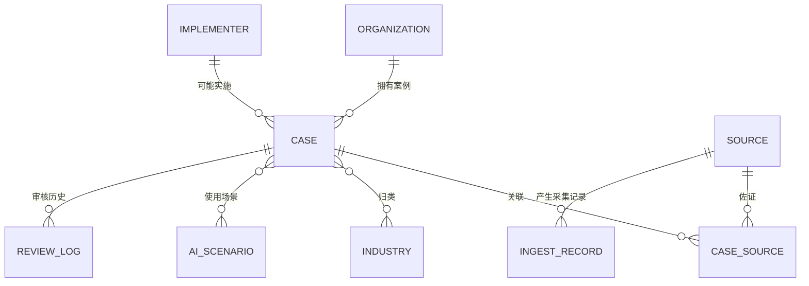
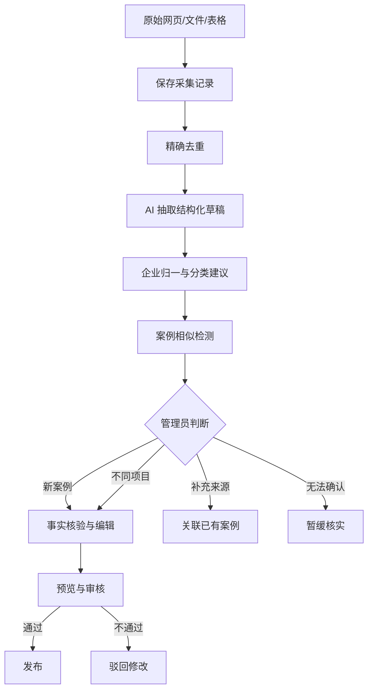
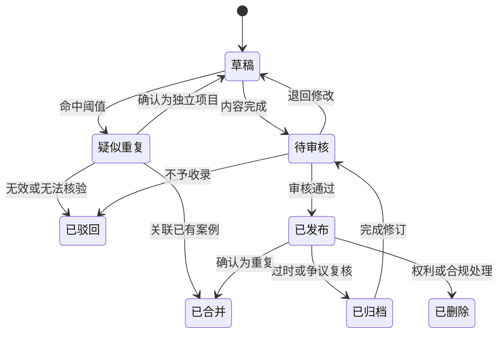

# 03 案例与内容治理

## 1. 目标

建立可长期扩展、可追溯、可审核的案例内容标准。确保不同来源被整理为统一格式，事实与 AI/编辑判断边界清晰，同一项目不会因多次采集形成重复案例。

## 2. 参与者与前置条件

### 2.1 参与者

- 内容管理员：整理、核验、审核和发布案例；
- AI 结构化服务：抽取字段、生成摘要、推荐分类和重复候选；
- 数据导入服务：保存原始材料并执行幂等检查；
- 普通用户：查看公开案例并提交更正申请。

### 2.2 前置条件

- 每个导入项目必须有来源 URL、来源文件或可识别的外部文档编号；
- 行业分类和 AI 场景词表已经初始化；
- 管理员能够访问来源原文或其合法保存的后台快照；
- AI 输出只能进入草稿或待审核状态。

## 3. 内容对象关系

企业主体和实施方在数据层可使用统一组织实体，通过角色区分；产品语言中仍分别称为“案例企业”和“实施公司”。

## 4. 企业主体字段

| 字段 | 必填 | 说明与约束 |
| --- | --- | --- |
| 企业 ID | 是 | 系统唯一标识 |
| 标准名称 | 是 | 公开材料中最完整、当前有效的名称 |
| 规范化名称 | 是 | 去除空白、常见公司后缀和全半角差异，仅用于匹配 |
| 简称 | 否 | 前台常用名称 |
| 曾用名 | 否 | 可多值，用于历史材料匹配 |
| 别名 | 否 | 品牌名、英文名、集团简称等，可多值 |
| 统一社会信用代码 | 否 | 仅在公开且可核实时保存，不作为前台默认展示字段 |
| 企业规模 | 否 | 人数原始值、人数区间、统计时间和来源 |
| 所属行业 | 是 | 至少关联一个当前行业分类节点 |
| 地区 | 否 | 国家、省、市；不得从不可靠材料推断 |
| 官网 | 否 | 规范化 URL |
| 匿名状态 | 是 | 公开企业、来源匿名、平台脱敏 |
| 备注 | 否 | 仅后台可见 |
| 创建/更新时间 | 是 | 系统生成 |

### 4.1 企业归一规则

- 统一社会信用代码完全一致时可自动建议为同一主体；
- 官网主域名一致、名称高度相似时进入人工确认；
- 集团与子公司不得自动合并；
- 品牌名与法律主体的关系不明确时保留独立实体并标记待核验；
- 企业相同只代表去重范围缩小，不能证明两个案例相同。

## 5. 案例项目字段

### 5.1 识别与状态

| 字段 | 必填 | 说明 |
| --- | --- | --- |
| 案例 ID | 是 | 系统唯一标识 |
| Slug | 是 | 稳定、唯一、可读；发布后变更必须保留重定向 |
| 案例标题 | 是 | 企业/行业 + 业务场景 + 核心动作，避免营销口号 |
| 案例企业 | 是 | 关联企业主体，匿名材料可关联匿名主体 |
| 案例结果 | 是 | 成功、部分达成、失败、结果未披露 |
| 内容状态 | 是 | 草稿、待审核、疑似重复、已发布、已驳回、已归档、已合并、已删除 |
| 可信度 | 是 | 高、中、待核验 |
| 项目时间 | 否 | 开始/结束/披露时间及精度；只知道年份时不得补造日期 |
| 首次发布/更新时间 | 否 | 系统记录 |
| 主案例 ID | 否 | 合并后指向保留的主案例 |

### 5.2 业务内容

| 字段 | 必填 | 空缺表达 |
| --- | --- | --- |
| 30 秒摘要 | 是 | 不允许为空 |
| 业务背景 | 是 | 不允许为空 |
| 遇到的问题 | 是 | 不允许为空 |
| AI 解决方案 | 是 | 不允许为空 |
| 实施步骤 | 否 | 来源未披露 |
| 使用模型/技术 | 否 | 来源未披露；不得作为标题噱头 |
| 现有系统与集成 | 否 | 来源未披露 |
| 实施周期 | 否 | 来源未披露 |
| 投入成本 | 否 | 来源未披露 |
| 最终效果 | 是 | 无公开效果时填写“结果未披露”的客观说明 |
| ROI | 否 | 来源未披露 |
| 风险与限制 | 否 | 来源未披露或编辑根据事实归纳 |
| 失败原因 | 条件必填 | 案例结果为失败时必须有明确来源支撑 |
| 编辑点评 | 是 | 适合对象、前置条件和建议优先级 |
| 实施公司 | 否 | 来源未披露 |

### 5.3 分类字段

- 主行业：必填且只能有一个，用于主要 URL 和统计；
- 辅助行业：可多选，用于跨行业案例；
- 企业规模区间：必填，未知时使用“未披露”；
- 主 AI 场景：必填且只能有一个；
- 辅助 AI 场景：最多 5 个；
- 业务部门：可多选，如销售、客服、采购、生产、财务、人力；
- 关键词：仅用于搜索补充，不替代正式分类。

### 5.4 数字字段规范

成本、周期、效果和 ROI 必须同时保存：原文表述、结构化最小值、最大值、单位、币种或百分比、统计周期、来源 ID 和是否估算。不能从“效率显著提升”推断百分比，也不能把“预计”展示为“实际”。

## 6. 信息来源

### 6.1 来源字段

| 字段 | 必填 | 说明 |
| --- | --- | --- |
| 来源 ID | 是 | 系统唯一标识 |
| 来源标题 | 是 | 原始标题，不为 SEO 改写 |
| 来源类型 | 是 | 政府、企业官方、实施商、上市公司披露、学术/行业机构、媒体、二次转载、其他 |
| 发布机构 | 是 | 原文责任主体 |
| 原始 URL | 条件必填 | 网页来源必填 |
| 规范化 URL | 条件必填 | 去跟踪参数、锚点并统一域名规则 |
| 外部文档编号 | 否 | 公告号、白皮书编号、案例编号等 |
| 原文发布日期 | 否 | 未知时为空，不使用采集日期替代 |
| 平台采集日期 | 是 | 系统生成 |
| 内容哈希 | 是 | 对规范化正文或文件计算 |
| 文件元数据 | 否 | 文件名、类型、大小、页码等 |
| 当前可访问性 | 是 | 正常、重定向、失效、受限 |
| 来源快照地址 | 否 | 后台私有，不在前台提供全文下载 |
| 使用许可备注 | 否 | 公开许可、已获授权或合理引用说明 |

### 6.2 来源关联

一个来源关联案例时需记录它支持哪些内容块和关键数字。主来源只能有一个；其他来源用于交叉验证或补充。移除关联不得删除来源和原始采集记录。

## 7. 可信度规则

### 7.1 评估维度

1. 来源层级：政府/监管披露、企业第一方、独立机构、实施商、媒体或二次转载；
2. 独立来源数量：来源是否真正独立，而非互相转载；
3. 关键字段完整度：问题、方案、时间、结果是否可追溯；
4. 信息一致性：不同来源对时间、数字和结论是否冲突；
5. 商业偏向：来源是否属于实施商营销材料；
6. 时效性：链接是否有效、内容是否被更新或撤回。

### 7.2 等级判定

| 等级 | 最低条件 | 前台表达 |
| --- | --- | --- |
| 高 | 至少一个可核验的一手来源且关键结论完整，或两个真正独立来源交叉支持；无未解释的关键冲突 | “来源充分，关键结论可追溯” |
| 中 | 单一可识别来源支持主要事实，但数据不完整、存在明显商业偏向或缺少独立交叉验证 | “主要信息可追溯，仍有部分未披露” |
| 待核验 | 主要依赖二次转载、来源失效、主体不明确或关键结论存在冲突 | “信息有限，请结合原始来源判断” |

可信度不代表平台担保项目效果。管理员可调整系统建议等级，但必须填写原因并记录审核日志。

## 8. 案例结果判定

| 状态 | 判定规则 |
| --- | --- |
| 成功 | 来源明确说明目标达成，且至少有一个可核验的实际结果；仅有预计效果不够 |
| 部分达成 | 部分目标实现、处于局部部署，或来源明确披露收益与未解决问题 |
| 失败 | 来源明确说明项目终止、撤回、未达到主要目标或产生重大负面结果 |
| 结果未披露 | 只有方案、签约、试点或预计效果，没有足够实际结果信息 |

失败案例公开发布必须满足以下任一条件：政府/监管/司法等权威公开材料明确确认；企业自身正式披露；两个独立可靠来源对核心事实一致。厂商营销文案的反向推断、单一匿名爆料和 AI 推测均不得作为失败结论。

## 9. 分类体系

### 9.1 行业分类

- 底层采用 GB/T 4754-2017 及第 1 号修改单的门类、大类、中类、小类结构；
- 每个节点保存标准版本、标准代码、标准名称、父节点和有效状态；
- 前台另设展示名称、简介、Slug、排序和是否重点展示；
- 案例优先标注到能够可靠判断的最细层级，不能可靠判断时停留在上级；
- 标准升级时创建新版本和映射表，不直接覆盖历史代码。

### 9.2 AI 场景受控词表

每个词条保存正式名称、Slug、定义、包含范围、排除范围、同义词、上级场景、状态和排序。AI 可以提出新词候选，但只有管理员批准后才能进入正式筛选。

首版建议覆盖：OCR/文档识别、智能客服、企业知识库、销售辅助、营销内容、智能报价、采购辅助、生产质检、预测性维护、需求预测、流程自动化、数据分析、代码辅助、Agent、Workflow、ERP/MES/CRM 智能化和其他。

## 10. 内容生产流程

### 10.1 人工审核清单

- 企业主体是否正确，集团和子公司是否混淆；
- 标题是否客观且与正文一致；
- 结果状态是否有足够证据；
- 所有数字是否能定位到来源；
- AI 是否补造未披露信息；
- 来源之间是否存在冲突；
- 引用是否必要、简短并附原文链接；
- 编辑点评是否被错误写成客观事实；
- 分类和场景是否使用正式词条；
- 是否存在高疑似重复未处理。

## 11. 引用、改写与更正规范

- 案例正文以平台结构化改写为主，不整篇复制原文；
- 必要直接引用保持简短，并在附近标注来源；
- 不移除原文中影响判断的限制条件；
- 不将“计划、预计、试点”改写成“已经、实际、全面上线”；
- 来源存在冲突时并列说明，不自行选择更有吸引力的数字；
- 收到有效更正后将案例置为复核中；严重争议可先归档再核查；
- 修改公开结论、结果状态或关键数字必须更新页面修改日期和审核日志。

## 12. 内容状态

## 13. 埋点与运营记录

后台记录 `case_created`、`case_ai_extracted`、`case_duplicate_flagged`、`case_review_submitted`、`case_published`、`case_archived`、`case_merged`、`source_link_failed` 和 `correction_submitted`。运营事件必须关联操作人、对象 ID、前后状态和时间。

## 14. 验收标准

1. 任一公开案例均能追溯到至少一个来源。
2. 同一案例可关联多个来源，新增来源不会复制案例正文。
3. 成本、周期、效果和 ROI 的数字均能定位到来源或明确标识为估算。
4. 失败案例不满足严格证据条件时不能发布为“失败”。
5. AI 推荐的新场景不能绕过管理员进入正式分类。
6. 企业别名可用于匹配，但集团与子公司不会自动合并。
7. 内容合并、归档和删除均保留原始采集记录与审核历史。

