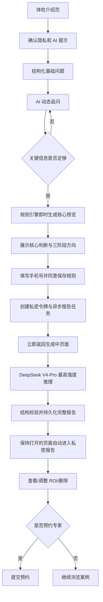
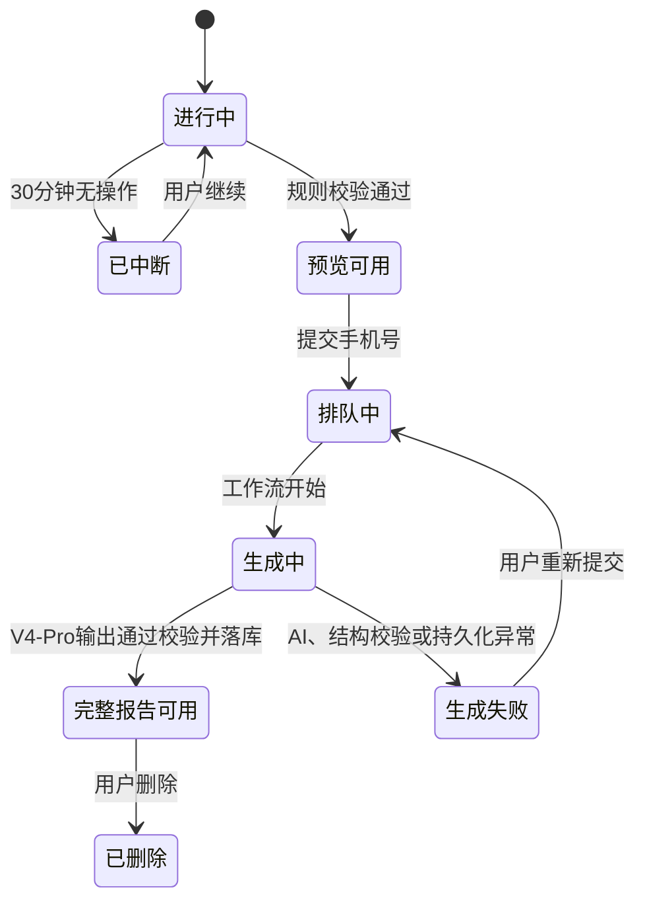

# 04 AI 企业体检

## 1. 目标

通过低门槛的结构化问诊，帮助企业用户识别适合优先开展的 AI 改造机会，生成可解释的阶段路线图和 ROI 经验区间，并在用户获得价值后承接专家预约。

## 2. 参与者与前置条件

### 2.1 参与者

- 匿名企业用户；
- AI 问诊与报告生成服务；
- 平台回访人员；
- 后台管理员。

### 2.2 前置条件

- 用户阅读并确认隐私提示、AI 生成提示和禁止输入敏感信息提示；
- 行业、企业规模、场景和业务部门词表可用；
- DeepSeek V4-Flash、V4-Pro 和持久任务服务已配置；
- MongoDB 可用，能够在请求结束后继续保存任务与报告状态；
- 报告在生成完成后通过保持打开的状态页直接进入私密报告，不再依赖邮件通知。

## 3. 产品边界

- 体检报告是前期机会判断，不是正式咨询交付物；
- 不提供法律、医疗、金融投资或安全生产决策；
- 不保证成本、收益、周期或实施效果；
- 不要求普通用户注册账号；
- 不在用户提交手机号前展示完整报告；
- 不将体检输入自动公开为案例。

## 4. 完整流程

## 5. 问诊交互

### 5.1 基础问题

| 顺序 | 主题 | 是否必答 | 输入方式 |
| --- | --- | --- | --- |
| 1 | 企业主要业务 | 是 | 行业选择 + 一句话补充 |
| 2 | 企业规模 | 是 | 人数区间 |
| 3 | 希望改善的部门/流程 | 是 | 多选，最多 3 项 |
| 4 | 最重复或耗时的工作 | 是 | 文本，10–500 字 |
| 5 | 当前使用的系统 | 否 | ERP/MES/CRM/OA/自研/表格/无等多选 |
| 6 | 每月业务量 | 否 | 数值区间 + 单位 |
| 7 | 当前人工投入 | 否 | 人数、小时或成本区间 |
| 8 | 数据形式和可用性 | 是 | 文档、表格、图片、语音、数据库等多选 |
| 9 | 预算范围 | 否 | 暂无、1 万以内、1–5 万、5–20 万、20 万以上、暂不透露 |
| 10 | 期望启动时间 | 否 | 立即、1–3 月、3–6 月、半年以后、仅了解 |

### 5.2 AI 动态追问

- 最多 5 个追问，总问答轮次不超过 15 轮；
- 每次只问一个问题，并解释为什么需要该信息；
- 优先补齐影响优先级和 ROI 区间的缺失信息；
- 不重复询问已经结构化收集的内容；
- 用户可选择“不知道”或“暂不透露”，系统不得阻塞；
- 检测到手机号、身份证、客户名单、密钥等不必要敏感信息时，提示用户删除或脱敏；
- 模型不得要求上传包含商业秘密的完整文件。

### 5.3 进度和中断

显示“基础信息 → 业务问题 → 改造条件 → 生成建议”四阶段进度，不承诺固定题数。会话在当前浏览器中自动恢复；超过 30 分钟无操作标记为中断，用户仍可继续。尚未提交手机号的会话通过浏览器匿名令牌访问；连续 30 天未继续且未绑定手机号的匿名会话自动删除。

## 6. 报告生成

### 6.1 异步生成原则

- 完成问诊时只同步执行规则预览，请求目标在 2 秒内返回，不等待 V4-Pro；
- 用户提交手机号后，接口仅完成校验、落库和持久任务入队，并返回不可猜测的状态令牌；
- 完整报告状态为“排队中、生成中、已完成、生成失败、已删除”；前端每 4 秒轮询一次，也允许用户直接关闭页面；
- V4-Pro 使用思考模式和最高推理强度，不因前台请求超时而降低分析强度；
- 任务步骤至少包括“标记处理中、生成并保存报告”，每步独立持久化并自动重试；
- 报告先成功落库，再标记“已完成”；
- 生成失败时不保存不完整正文，页面明确提示重新提交，后台保留不含问诊原文的错误代码；
- 持久任务只传递随机 jobId，不将手机号、问诊原文、私密令牌或报告正文写入任务事件日志。

### 6.2 报告结构

1. 企业画像摘要；
2. 当前主要问题和机会；
3. 推荐优先级总览；
4. 第一阶段：低风险、可快速验证项目；
5. 第二阶段：数据和流程基础建设；
6. 第三阶段：较高复杂度或跨系统项目；
7. 每项建议的适用原因、前置条件、投入级别、风险和预期影响；
8. ROI 行业经验区间及假设；
9. 不建议优先实施的事项及原因；
10. 90 天行动清单；
11. 可参考的站内案例；
12. 免责声明和生成时间。

### 6.3 优先级规则

每项候选改造从业务影响、重复频率、数据可用性、实施难度、系统依赖、风险和预算匹配度进行评分。报告展示“建议优先、条件具备后开展、暂不建议”三档和简明理由，不向用户展示伪精确的内部小数分。

### 6.4 案例推荐

根据行业、规模、问题和场景从已发布案例中召回；优先选择可信度高或中的案例。最多推荐 5 条，不得把案例结果未披露误写为成功经验。

## 7. ROI 经验区间

### 7.1 展示原则

- 只展示区间，不展示无依据的单点结论；
- 明确区分“来源基准”和“AI 推测区间”；
- 列出所有输入和默认假设；
- 显示低、中、高置信度及影响因素；
- 允许用户修改关键变量并重新计算；
- 不把预计收益写成实际收益。

### 7.2 输入字段

当前业务量、单次处理时间、参与人数、人力成本、错误/返工成本、可自动化比例、预计采用率、初始实施费用、持续订阅/运维费用和统计周期。用户未提供的数据使用行业经验区间，并逐项标记“平台基准”或“AI 推测”。

### 7.3 输出字段

| 字段 | 说明 |
| --- | --- |
| 初始投入区间 | 一次性实施、集成、数据整理和培训成本 |
| 持续成本区间 | 模型、软件、运维和人工复核成本 |
| 月度节省区间 | 时间、人力和错误减少带来的经验估值 |
| 回收期区间 | 总投入 / 月度净收益，分母非正时不计算 |
| 三档情景 | 保守、基准、积极；每档使用明确假设 |
| 置信度 | 基于用户数据完整度和基准可靠性 |
| 敏感变量 | 对结果影响最大的 1–3 个输入 |

### 7.4 异常规则

- 输入不足时可以给投入和影响方向，但不得给精确回收期；
- 回收期超过估算窗口时显示“在当前假设下无法在窗口内回收”；
- 数据单位冲突或明显异常时要求确认，不直接计算；
- 修改变量后保留报告原始版本和最新版本，但前台默认展示最新版本。

## 8. 报告预览与手机号启动

### 8.1 免费预览

预览必须展示企业画像、三阶段优先级名称、第一阶段首选项目、一个关键风险和 ROI 估算是否可用。不得只显示模糊摘要后强制留资。

### 8.2 手机号表单

字段为手机号、是否同意接收本次报告和隐私确认。营销订阅必须独立、默认勾选，不得与领取报告捆绑。

### 8.3 异步任务与私密链接

- 手机号格式校验通过后，先创建报告任务和状态页，再异步生成完整报告；
- 状态页明确说明通常需 1–3 分钟、可关闭页面；页面保持打开时自动更新并在完成后进入私密报告；
- 报告正文不直接包含全部敏感输入，状态页以私密链接为主，供用户复制保存；
- 状态令牌和报告令牌必须分别生成，均使用密码学安全随机值；状态令牌不能直接读取报告；
- 报告集合仅保存报告令牌哈希；报告令牌在生成后持续保留，供保持打开的状态页直接进入；
- 应用日志、埋点和前端错误上报不得记录状态令牌、报告令牌、完整手机号或原始问答；
- 报告页必须设置 `noindex,nofollow,noarchive`，不进入 Sitemap；
- 用户关闭页面后无法通过邮件找回链接，状态页应在生成完成时提示用户复制保存私密链接。

## 9. 报告管理与删除

### 9.1 保存规则

已绑定手机号的会话、原始问答、结构化答案、报告版本和手机号持续保存至用户主动删除。未绑定手机号且连续 30 天未继续的匿名会话自动删除。用户提交手机号前和提交时均需看到保存用途和删除方式。

### 9.2 用户能力

- 查看完整报告；
- 修改 ROI 变量并生成新版本；
- 导出打印友好的报告；
- 复制当前私密链接以便再次访问；
- 删除本次会话、报告、手机号关联和相关预约草稿；
- 查询删除处理结果。

### 9.3 删除确认

用户通过有效报告会话发起删除时需要二次确认；会话不可用时通过报告会话与私密令牌验证。删除后撤销所有报告令牌和报告会话，并删除或不可逆匿名化个人信息。为防止滥用保留的最小安全日志不得包含原始问答或完整手机号。

## 10. 专家预约

### 10.1 表单字段

姓名、企业名称、职位、需求摘要、期望沟通时间、手机号、微信号、报告 ID 和隐私确认。手机号或微信号至少填写一项；姓名、企业名称和需求摘要必填。

### 10.2 状态

新提交、待回访、已联系、已完成、无效、用户取消。V1 由平台人工处理，不自动匹配实施商。

### 10.3 异常与防滥用

- 同一报告短时间重复提交时提示已收到，不生成重复预约；
- 联系方式格式异常时阻止提交；
- 提交成功不承诺固定响应时间，页面展示平台实际服务说明；
- 后台导出预约数据必须记录操作日志。

## 11. 会话与报告状态

## 12. 埋点

`assessment_landing_view`、`assessment_consent_accept`、`assessment_start`、`assessment_step_complete`、`assessment_abandon`、`assessment_preview_generated`、`assessment_phone_submit`、`assessment_job_queued`、`assessment_job_ready`、`assessment_job_failed`、`assessment_report_ready`、`assessment_report_open`、`assessment_roi_recalculate`、`assessment_delete_request`、`assessment_deleted`、`expert_booking_submit`。

埋点不得包含原始问答、完整手机号或微信号。

## 13. 验收标准

1. 用户无需注册即可完成问诊并查看有实际内容的报告预览。
2. AI 追问不超过 5 个，已回答问题不会重复询问。
3. 完整报告只能在手机号确认后通过私密令牌访问，且不可被索引。
4. ROI 输出包含区间、假设、来源类型和置信度，异常输入不会生成伪精确结论。
5. 完整报告在保持打开的状态页生成完成后即可进入，关闭页面前需复制保存私密链接，原令牌不失效。
6. 用户可以删除完整会话、报告和手机号关联，删除后原链接立即失效。
7. 预约专家时手机号或微信满足至少一项，重复提交不会产生重复线索。
8. 提交手机号的 HTTP 请求不等待 V4-Pro 完成，返回 `202` 和状态令牌；关闭页面不会中断后台任务。
9. V4-Pro 任务在服务重启或重新部署后可恢复，已成功步骤不会重复执行。
10. 完整报告落库后即为可用，状态页可立即进入私密报告。
