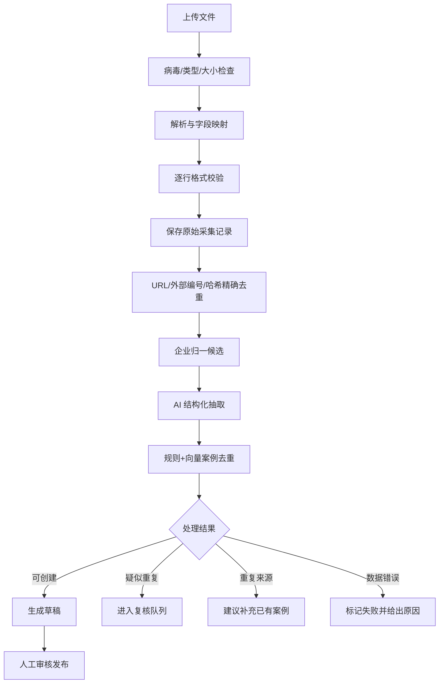

# 05 运营后台

## 1. 目标

为兼职运营者提供低维护成本的内容工作台，支持案例从原始材料进入、AI 结构化、去重、人工核验到发布的完整流程，并保留可审计记录。

## 2. 参与者与权限

V1 只有一个管理员角色。管理员可管理全部内容、分类、导入任务、体检报告元数据、预约和配置。高风险操作仍需二次确认，包括发布失败案例、合并案例、永久处理个人信息、导出线索和修改去重阈值。

管理员认证采用 Auth.js 凭据登录，账户及密码哈希保存在 MongoDB；不开放自助注册、找回和多角色授权。首次管理员通过部署初始化命令创建，生产环境禁止默认密码。

## 3. 后台导航

- 工作台；
- 案例；
- 企业与实施方；
- 来源与采集记录；
- 批量导入；
- 疑似重复；
- 行业分类；
- AI 场景词表；
- AI 企业体检；
- 专家预约；
- 内容更正；
- SEO 与数据概览；
- 系统配置；
- 操作日志。

## 4. 工作台

显示待处理数量和快捷入口：待审核案例、疑似重复、导入失败、来源失效、报告生成失败、新预约、内容更正和近 7/30 天核心指标。指标异常不得阻止内容编辑。

## 5. 单篇案例管理

### 5.1 创建方式

- 从空白表单创建；
- 粘贴来源 URL 后抓取公开正文并生成草稿；
- 上传 PDF/DOCX/TXT 等来源文件后生成草稿；
- 从现有来源创建新案例；
- 复制已有案例结构但不复制来源和事实字段。

### 5.2 编辑器

按照“主体 → 分类 → 背景问题 → 方案 → 实施 → 成本效果 → 风险结果 → 点评 → 来源 → SEO”分组。数字字段必须选择来源或标记为估算；来源未披露时使用专用值，不能只留空。

### 5.3 保存与发布

- 草稿自动保存并显示最后保存时间；
- 提交审核前执行必填、来源、数字、分类、重复和敏感词检查；
- 发布前展示与前台一致的预览；
- 发布失败案例时额外显示证据清单并二次确认；
- 已发布案例修改关键结论后重新进入待审核，原版本继续公开直至新版本通过；
- 每次发布形成不可变版本快照。

## 6. 批量导入

### 6.1 支持格式

V1 支持 UTF-8 CSV 和 XLSX。单次最多 1,000 行、文件最大 20 MB；超出时拒绝并提示拆分。文件先上传到私有对象存储，解析后进入导入暂存区。

### 6.2 标准模板

模板字段分为：

- 来源：`source_url`、`source_title`、`source_type`、`publisher`、`published_at`、`external_id`；
- 企业：`organization_name`、`organization_aliases`、`organization_size`、`industry_code`；
- 案例：`case_title`、`background`、`problem`、`solution`、`duration`、`cost`、`result_text`、`outcome_status`、`roi`；
- 分类：`primary_scenario`、`secondary_scenarios`、`business_functions`；
- 辅助：`source_excerpt`、`operator_note`。

模板允许只有来源和原始文本，由 AI 补充草稿字段。模板版本必须写入导入任务，字段升级时继续兼容上一主版本。

### 6.3 导入主流程

### 6.4 导入结果

按总行数、已解析、已创建草稿、重复来源、疑似重复、失败和待处理展示。管理员可下载错误报告，修正后只重试失败行；重试必须沿用原始导入任务和幂等键，不得复制成功记录。

## 7. AI 结构化

### 7.1 输出要求

AI 返回符合固定结构的字段值、每个关键字段的证据片段和来源位置、缺失字段、冲突提示、行业/场景建议、结果状态建议、可信度建议及生成版本。

### 7.2 约束

- 温度使用稳定抽取配置；
- 所有结构化输出先做 Schema 校验；
- 数字必须附证据位置，否则转为未披露；
- AI 无权修改正式企业主体、行业和场景词表；
- AI 输出错误允许单条重试，旧输出保留用于审计；
- 原始内容中的指令被视为不可信文本，不能改变系统抽取规则。

## 8. 去重机制

### 8.1 第一层：来源精确去重

按以下顺序检查：

1. 规范化 URL 唯一键；
2. 发布机构 + 外部文档编号唯一键；
3. 文件或规范化正文 SHA-256 内容哈希；
4. 同一导入任务行幂等键。

命中时不创建新来源，更新最后采集时间和可访问状态，并进入“是否补充已有案例”的处理流程。

### 8.2 URL 规范化

- 主机名转小写，移除默认端口；
- 移除锚点；
- 移除 `utm_*`、`spm`、`from` 等已配置跟踪参数；
- 查询参数按名称排序；
- 根据站点规则统一尾部斜杠、移动端域名和打印页；
- 不擅自删除可能决定正文内容的业务参数。

保存原始 URL 和规范化 URL，规则更新后允许重新计算但不能静默覆盖历史值。

### 8.3 第二层：企业实体归一

按信用代码、官网主域名、标准化名称、别名和语义相似度召回候选。信用代码完全一致可自动关联；其他情况只给出建议。集团、子公司、品牌与法律主体关系必须人工确认。

### 8.4 第三层：案例综合匹配

综合分由以下特征构成，权重作为 V1 默认值并允许后台配置：

| 特征 | 权重 |
| --- | ---: |
| 企业主体匹配 | 0.30 |
| 标题与全文语义相似 | 0.25 |
| 主/辅助 AI 场景 | 0.15 |
| 业务部门与问题 | 0.10 |
| 项目/披露时间接近度 | 0.08 |
| 实施公司匹配 | 0.05 |
| 效果指标与关键数字 | 0.07 |

企业不同且没有集团关系时，综合分上限设为 0.74，避免通用“智能客服”案例互相误判。时间未知不计零分，而是按其余有效特征重新归一。

### 8.5 阈值和动作

| 综合分 | 动作 |
| --- | --- |
| ≥ 0.90 | 高疑似重复，阻止直接发布并要求人工处理 |
| ≥ 0.75 且 < 0.90 | 中疑似重复，允许保存草稿但发布前必须确认 |
| < 0.75 | 不因重复规则阻塞，但仍可人工标记 |

除精确重复来源外，系统不得自动合并案例。阈值调整只影响新检测任务；历史决定不自动重写。

### 8.6 人工复核界面

左右并排展示企业、标题、行业、场景、业务部门、时间、实施商、方案摘要、效果数字、来源和差异高亮。管理员必须选择：

- 补充已有案例来源；
- 同企业不同项目；
- 独立案例；
- 暂缓核实；
- 无效记录。

每个决定记录操作人、时间、候选分、规则版本和理由。选择“同企业不同项目”后，该案例对同一候选不再重复提示，除非核心内容发生重大变化。

## 9. 来源与快照管理

- 来源列表支持按类型、可访问性、关联案例和采集时间筛选；
- 定期链接检测属于后台维护任务，不属于自动内容爬虫；
- 原文快照仅管理员可访问，使用短期签名 URL；
- 来源失效不自动删除案例，产生复核任务；
- 权利人请求移除快照时先限制访问并进入合规处理；
- 来源之间冲突时在审核界面并列显示，不让 AI 自动裁决。

## 10. 分类与词表管理

行业分类支持版本导入、父子树、前台名称映射、启停和旧新版映射。标准代码不可被人工随意修改。AI 场景支持正式词、同义词、定义、边界、合并和停用；合并后旧 Slug 301 跳转，历史案例迁移到目标词条。

## 11. 体检、预约与更正管理

- 体检列表默认只显示脱敏手机号、状态、行业、创建时间和是否预约；
- 报告任务分别展示排队、推理、完成、失败和删除状态；
- 报告生成失败后只允许重新生成，不重复创建会话或报告；
- 私密报告令牌不会出现在列表、URL 参数、操作日志或浏览器分析事件中；
- 查看原始问答属于高敏操作，必须二次确认并记录日志；
- 预约支持状态、负责人备注和联系结果；
- 联系方式导出必须二次确认并记录导出范围；
- 删除请求显示进度和处理结果，不允许恢复已完成删除；
- 内容更正支持待处理、核查中、已更正、已驳回和已关闭状态。

## 12. 操作日志

记录登录、失败登录、创建、编辑、发布、归档、合并、删除、阈值修改、分类修改、来源快照访问、体检原文访问、线索导出和个人信息删除。日志包含操作人、动作、对象、时间、请求标识、前后差异摘要和结果，不记录密码、完整令牌和不必要个人信息。

## 13. 异常流程

- 文件解析失败：保留任务和错误，不产生半成品案例；
- AI 服务失败：原始记录保持“待抽取”，可更换备用模型重试；
- 向量生成失败：允许进入草稿，但禁止跳过去重直接发布；
- 导入过程中断：任务可从最后已确认步骤恢复；
- 并发编辑：使用版本号检测冲突，后提交者必须查看差异；
- 发布后搜索索引失败：案例保持已发布，工作台提示重新同步；
- 合并目标不存在或已删除：阻止合并并要求重新选择。

## 14. 状态与埋点

导入任务状态：已上传、解析中、校验失败、待抽取、抽取中、待去重、待人工处理、已完成、部分完成、已取消。

后台记录 `admin_login`、`import_created`、`import_row_failed`、`extraction_retry`、`duplicate_decision`、`case_publish`、`case_merge`、`taxonomy_change`、`lead_export` 和 `personal_data_delete`。

## 15. 验收标准

1. 相同规范化 URL、外部编号或内容哈希不会生成重复来源。
2. 同企业不同项目不会仅因企业相同被自动合并。
3. 综合分达到阈值时出现正确阻断或提示，且所有项目级合并均需人工决定。
4. 批量导入可逐行报告成功、失败和重复，并可安全重试失败行。
5. AI 抽取的每个关键数字都有证据位置，否则显示未披露。
6. 发布、合并、阈值修改、敏感数据访问和导出均存在审计日志。
7. 原始采集记录和审核历史不会因案例合并、归档或删除而意外丢失。
8. 报告生成失败后在后台显示独立异常状态，可安全地幂等重试生成，不重复创建会话或报告。
