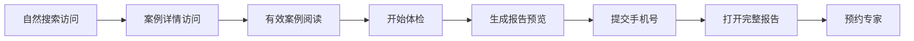

# 06 SEO、数据分析与合规

## 1. 目标

通过高质量、可索引的案例内容获得长期自然搜索流量，同时建立准确的产品指标、个人信息保护、AI 内容标识和内容权利处理规则。本章定义产品与工程要求，不替代正式法律意见；公开上线前必须完成适用于实际运营主体和部署方式的合规审查。

## 2. SEO 参与者与前置条件

### 2.1 参与者

- 搜索引擎爬虫；
- 从自然搜索进入的企业用户；
- 内容管理员；
- SEO/数据分析服务；
- 提交隐私或内容权利请求的个人和机构。

### 2.2 前置条件

- 公开页面只使用已审核发布的数据；
- 每个可索引页面具有稳定规范 URL；
- 站点拥有可配置的正式域名；
- 埋点、Cookie 和第三方脚本清单已完成评审；
- 隐私政策、使用条款和内容声明已发布。

## 3. URL 与索引规则

### 3.1 URL 结构

| 页面 | URL 示例 | 默认索引 |
| --- | --- | --- |
| 首页 | `/` | 是 |
| 案例列表 | `/cases` | 是 |
| 案例详情 | `/cases/{slug}` | 是，限已发布案例 |
| 行业聚合 | `/industries/{slug}` | 条件索引 |
| 场景聚合 | `/scenarios/{slug}` | 条件索引 |
| 临时搜索 | `/search?q=...` | 否 |
| 任意组合筛选 | `/cases?...` | 否，Canonical 指向 `/cases` 或合法聚合页 |
| AI 体检介绍 | `/assessment` | 是 |
| 体检问诊 | `/assessment/session/{id}` | 否 |
| 报告令牌交换 | `/reports/access#token=...` | 否；Fragment 不发送给服务器 |
| 私密报告 | `/reports/{reportId}` | 否；必须具有报告范围会话 |
| 后台 | `/admin/*` | 否且禁止爬取 |

### 3.2 聚合页收录门槛

行业或 AI 场景聚合页必须同时满足：至少 5 条已发布案例；具有人工维护的独立导语；标题和描述不与其他页面仅做关键词替换；内容没有重大来源争议。满足时使用 `index,follow`，否则使用 `noindex,follow` 且不进入 Sitemap。

### 3.3 页面状态

- 案例合并：旧 URL 永久重定向至主案例；
- Slug 变化：旧 Slug 永久重定向至新 Slug；
- 案例归档：页面可保留说明，但设为 `noindex,follow`；
- 合规删除且无替代：返回 410；
- 暂时不存在：返回真实 404，不使用软 404；
- 报告、预览和问诊页统一设置 `noindex,nofollow,noarchive`。

## 4. 页面元数据

### 4.1 案例详情

- Title：`{企业/匿名描述}{AI场景}案例：{核心业务结果}｜AI案例库`；
- Description：使用经审核的 30 秒摘要，控制为适合搜索摘要的长度；
- Canonical：当前主案例绝对 URL；
- Open Graph：标题、摘要、统一品牌图、页面 URL；
- 文章时间：首次发布时间和最后实质更新时间；
- 不在 Title 中使用来源未披露的数字或夸大措辞。

### 4.2 聚合页

标题和描述来自人工编辑字段，不根据任意筛选参数自动拼接。无独立导语时即使案例达到 5 条也不能索引。

## 5. 结构化数据

- 全站组织信息使用适用的 `Organization`；
- 案例内容使用与页面实际内容一致的 `Article`，作者标明 AI案例库编辑团队；
- 面包屑使用 `BreadcrumbList`；
- FAQ 仅在页面真实展示问答时输出对应结构化数据；
- 不将 AI 估算 ROI 标记为产品价格、评分或保证收益；
- 结构化数据必须随案例归档、合并和删除同步更新。

## 6. Sitemap、Robots 与站内链接

- Sitemap 只包含首页、已发布案例、满足门槛的聚合页和可索引公共页面；
- 按案例量拆分 Sitemap，记录真实 `lastmod`，不因无实质内容变化刷新；
- `robots.txt` 禁止后台、问诊过程和私密报告路径，但敏感数据保护不能只依赖 Robots；
- 首页、聚合页、详情页和相关案例形成可爬取的站内链接；
- 内容更新后触发 Sitemap 重建和缓存失效，不依赖手工部署。

## 7. 内容 SEO 规则

1. 每个案例只对应一个规范 URL，不为同义关键词复制正文。
2. 标题首先描述企业问题和结果，不堆砌模型名称。
3. 案例正文必须提供来源、披露时间和适用边界。
4. 聚合页需要独立导语和真实案例，不创建大量空行业页。
5. 成功与失败案例均可被索引，但失败结论必须满足严格证据条件。
6. AI 结构化内容必须经人工审核并显式说明 AI 辅助整理。
7. 失效来源产生复核任务；页面不得悄悄移除所有来源后继续保持高可信度。

## 8. 数据分析口径

### 8.1 匿名访客

使用第一方匿名访客 ID，避免设备指纹。用户清理浏览器数据后可以形成新 ID。分析事件不携带手机号、微信、原始问答或完整搜索中的敏感信息。

### 8.2 北极星指标

“有效案例阅读人数”满足：案例详情处于前台可见；标签页活动；累计 30 秒；最大阅读深度达到 50%；同一匿名访客、案例、自然日只计一次。机器人、管理员预览、自动化测试和已知监控请求排除。

### 8.3 事件公共字段

事件名、事件版本、匿名访客 ID、会话 ID、页面类型、对象 ID、来源渠道、UTM、设备类别、事件时间、实验标识和同意状态。URL 在入库前移除私密令牌和非必要查询参数。

### 8.4 核心漏斗

### 8.5 数据质量

- 事件接收接口按事件幂等 ID 去重；
- 客户端事件和服务端关键转化事件分开标识；
- 手机号提交、报告生成和预约成功以服务端事件为准；
- 事件 Schema 变化必须提升版本；
- 每周检查事件量异常、漏斗断层和机器人流量。

## 9. 个人信息清单

| 场景 | 数据 | 目的 | 可见范围 | 保存规则 |
| --- | --- | --- | --- | --- |
| 体检 | 原始问答、结构化答案 | 生成和改进报告 | 用户本人、受控管理员、AI 服务商必要处理 | 已绑定手机号时至用户主动删除；未绑定且 30 天未继续则自动删除 |
| 报告领取 | 手机号 | 启动异步报告与平台回访联系 | 受控管理员 | 已绑定手机号时至用户主动删除 |
| 专家预约 | 姓名、企业、职位、手机或微信、需求 | 人工回访 | 受控管理员 | 至用户删除或运营主体依法调整 |
| 联系我们 | 姓名、手机号或微信、咨询内容 | 回复咨询 | 受控管理员 | 按隐私政策约定 |
| 分析 | 匿名访客 ID、事件 | 产品分析 | 受控管理员、分析服务商 | 默认 24 个月后聚合或删除 |
| 安全日志 | IP 摘要、操作和时间 | 防滥用与审计 | 运维管理员 | 默认 180 天，法律另有要求除外 |

“持续保存至用户删除”属于已确认产品决策，但上线前必须证明其处理目的、必要性和告知方式成立；若正式合规评估认定不符合最短必要原则，应将自动到期策略作为上线阻断项调整，而不是通过模糊文案规避。

## 10. 隐私交互要求

- 首次体检前说明收集内容、使用目的、第三方 AI 处理和删除方式；
- 提交手机号时再次说明长期保存规则；
- 私密报告页提供删除入口；
- 营销订阅与报告发送分开同意，默认勾选；
- 用户能够请求查阅、复制、更正和删除个人信息；
- 管理员访问体检原文、导出联系方式和处理删除均写入审计日志；
- 不要求用户提供身份证号、个人精确位置或与报告无关的数据；
- 用户输入商业秘密前应得到显著提醒，平台不鼓励上传完整客户名单、密钥或未脱敏文件。

## 11. 第三方与跨境评估

DeepSeek、EdgeOne Pages、MongoDB Atlas、腾讯云 COS 和分析服务均需进入第三方清单，记录服务地区、处理数据、用途、保存策略、合同与安全措施。若个人信息被提供至境外服务，必须在正式上线前按实际数据流完成单独评估、告知和必要授权；无法满足时应改用境内服务或阻止相关数据出境。

默认不把原始体检问答发送给备用模型，除非主模型失败且用户告知覆盖该处理。发送给模型前应移除手机号、微信和其他可识别字段。

## 12. AI 内容标识与透明度

- 案例页在 AI 整理内容附近展示“AI 辅助整理，已经人工审核”；
- 体检交互开始前和报告页展示“内容由 AI 生成”；
- AI 估算使用独立视觉标识，不与来源事实混排；
- 导出或下载 AI 报告时保留可感知的显式 AI 标识；
- 对适用的导出文件按现行规则加入生成内容属性、服务提供者和内容编号等元数据；
- 用户协议说明 AI 标识方式，不提供移除标识的功能；
- 管理员修改 AI 文本后仍保留生成来源和审核记录。

标识设计和导出元数据需对照《人工智能生成合成内容标识办法》及 GB 45438-2025 实施要求完成上线检查。

## 13. 内容权利、申诉与投诉

- 所有案例页提供内容更正入口；
- 权利请求至少支持来源移除、事实更正、企业身份更正、个人信息删除和侵权投诉；
- 请求提交后生成工单并发送确认，不公开投诉人信息；
- 涉及企业失败结论、名誉或重大事实争议时优先限制传播并人工复核；
- 不因原链接失效自动证明内容错误，也不因来源来自官方就拒绝更正；
- 原文快照只用于后台核验，不对公众提供整篇下载；
- 处理结论及依据写入审核日志，必要时更新页面修订日期。

## 14. 安全与滥用防护

- 体检生成、预约和联系表单按 IP/匿名会话/手机号限流；
- 用户输入进行长度、类型、恶意 HTML 和提示注入防护；
- 私密令牌通过 URL Fragment 传递并以 POST 交换为 HttpOnly 报告会话，不得出现在分析事件、访问日志、查询参数或 Referer；
- 页面设置严格内容安全策略和安全响应头；
- 后台敏感数据默认脱敏，按需二次确认查看；
- 定期验证备份恢复和用户删除在备份中的处理规则。

## 15. 参考依据

- [中华人民共和国个人信息保护法](https://www.npc.gov.cn/npc/c2/c30834/202108/t20210820_313088.html)
- [生成式人工智能服务管理暂行办法](https://www.cac.gov.cn/2023-07/13/c_1690898327029107.htm)
- [人工智能生成合成内容标识办法](https://www.cac.gov.cn/2025-03/14/c_1743654684782215.htm)

## 16. 验收标准

1. 私密报告、问诊、后台和临时筛选页均不会进入 Sitemap 或搜索索引。
2. 聚合页只有满足 5 条案例和独立导语时才允许索引。
3. 有效阅读事件满足时长、深度、前台可见和自然日幂等要求。
4. 分析事件中不存在完整手机号、电话、微信、问答或私密令牌。
5. AI 案例摘要、体检报告和导出物具有明确 AI 标识。
6. 用户可以查阅、更正和删除个人信息，敏感后台访问均有日志。
7. 上线前完成第三方数据流、跨境、AI 标识和长期保存规则的正式合规评审。
