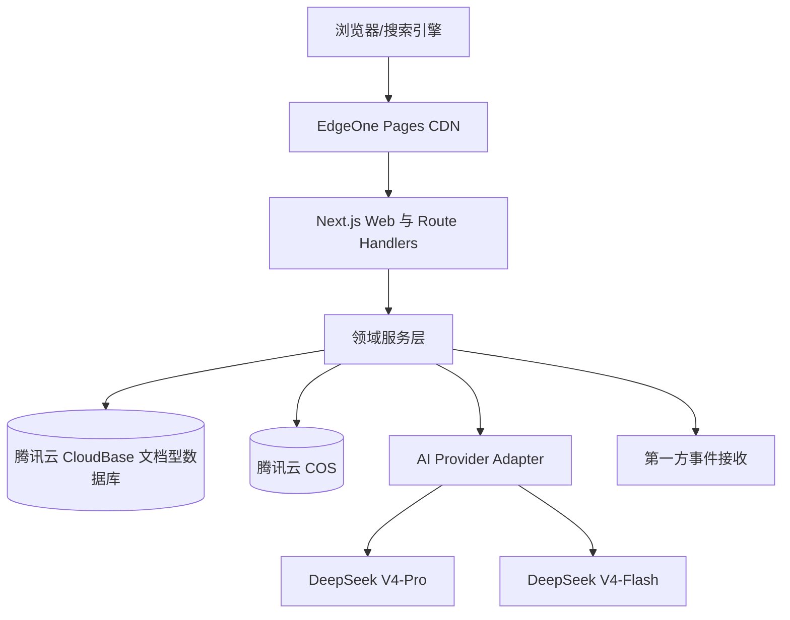

# 07 技术附录

## 1. 目标与技术基线

本章给出 V1 可直接实施的系统边界、数据模型、索引、接口、认证、AI、存储和部署方案。数据库统一使用 MongoDB，不使用 PostgreSQL、Supabase 数据库或 `pgvector`。

| 层级 | V1 选型 |
| --- | --- |
| Web 应用 | Next.js App Router + TypeScript |
| UI | TailwindCSS + shadcn/ui |
| 主数据库 | 腾讯云 CloudBase 文档型数据库（`@cloudbase/node-sdk`，替代 MongoDB / MongoDB Atlas） |
| 关键词搜索 | CloudBase 文档数据库跨字段正则匹配，中文按子串检索 |
| 向量检索 | 暂未启用；去重以规则/哈希（`dedupVector`）为主，相似案例推荐降级为“同行业/同场景”匹配 |
| 对象存储 | 腾讯云对象存储 COS，私有 Bucket |
| 管理员认证 | Auth.js Credentials + JWT，会查询 MongoDB 管理员账户 |
| AI | DeepSeek V4-Pro 深度分析、DeepSeek V4-Flash 动态追问 |
| 持久任务 | Next.js Route Handler 内的普通异步后台任务（fire-and-forget），不依赖平台专属工作流引擎 |
| 部署 | 腾讯云 EdgeOne Pages |

## 2. 总体架构



### 2.1 设计原则

- Web 层只负责认证、参数校验和响应转换，业务规则位于领域服务层；
- 搜索、AI 和对象存储均通过接口隔离，不在页面组件直接调用；
- 公开读取和后台写入使用不同服务边界；
- 未审核内容不进入公开搜索索引；
- 需要幂等的导入和删除操作均使用显式幂等键；
- 大文件和原始快照不存入 MongoDB 文档，避免单文档过大。

## 3. 数据库集合（CloudBase 文档型数据库）

> **实现变更说明**：V1 设计基线原为 MongoDB Atlas，生产已改为腾讯云 CloudBase 文档型数据库。案例文档内联 `organization`（不再单独建 `organizations` 集合），核心公开集合为 `cases` 与 `sources`；其余 `admin_users`、`assessment_*`、`appointments`、`audit_logs` 等集合用途与设计基线一致。关键词搜索使用跨字段正则匹配，向量检索暂未启用，相似案例降级为“同行业/同场景”推荐。已上线数据包含 6 条标明来源的真实企业案例（`demo:false`）与 12 条演示案例。

| 集合 | 用途 | 关键关系 |
| --- | --- | --- |
| `admin_users` | 单管理员账户、密码哈希、状态 | 审计日志操作人 |
| `organizations` | 企业、实施方和别名 | 被案例引用 |
| `cases` | 当前案例公开/编辑版本 | 企业、分类、主来源 |
| `case_versions` | 每次提交审核和发布的不可变快照 | 关联案例 |
| `sources` | 去重后的来源元数据 | 被多个案例引用 |
| `case_sources` | 案例与来源的关联、证据字段 | 多对多边 |
| `ingest_records` | 原始 URL/文件/表格行和抽取状态 | 来源、导入任务 |
| `ingest_chunks` | 超长抽取文本分块 | 关联采集记录 |
| `import_jobs` | 文件级导入任务 | 包含模板版本和计数 |
| `import_rows` | 行级校验、幂等和结果 | 关联导入任务 |
| `duplicate_candidates` | 案例匹配分、特征和人工决定 | 新旧案例 |
| `taxonomy_nodes` | 带版本的国家行业分类 | 案例分类 |
| `taxonomy_mappings` | 标准新旧版本映射 | 分类迁移 |
| `scenario_terms` | AI 场景、同义词和状态 | 案例场景 |
| `assessment_sessions` | 问诊原文和结构化答案 | 报告、手机号 |
| `assessment_jobs` | 异步报告状态、工作流 ID 和令牌哈希 | 体检会话、报告 |
| `assessment_reports` | 报告版本、ROI 和令牌哈希 | 体检会话 |
| `appointments` | 专家预约和回访状态 | 报告、会话 |
| `correction_requests` | 内容更正和权利请求 | 案例/来源 |
| `analytics_events` | 经过脱敏的第一方关键事件 | 匿名访客/对象 |
| `audit_logs` | 高风险后台操作日志 | 管理员/对象 |
| `system_config` | 阈值、热门排序和功能开关 | 版本化配置 |

### 3.1 MongoDB 建模规则

- 小型、随主对象一起读取且不独立更新的数据可嵌入，例如案例摘要和结果数值；
- 可复用、持续增长或需要独立审核的数据使用引用，例如来源、版本、采集记录和日志；
- 所有核心文档包含 `schemaVersion`、`createdAt`、`updatedAt`；
- 所有可软删除文档包含 `deletedAt` 和 `deletedBy`；
- 所有写接口使用 JSON Schema/TypeScript Schema 双层校验；
- ObjectId 只在内部使用，对外 API 使用不可枚举的字符串 ID；
- 原始文件、PDF、网页快照和大段原文保存到腾讯云 COS，MongoDB 只存元数据、提取文本或分块引用。

## 4. 核心文档结构

### 4.1 `cases`（实际落地结构，CloudBase 文档型数据库）

> 案例文档内联 `organization`（无独立 `organizations` 集合）。`id` 为对外不可枚举字符串标识，`slug` 为稳定 URL。`demo:false` 表示已上线的真实企业案例，`demo:true` 为演示案例。

```ts
type CaseStudy = {
  // —— 标识与版本 ——
  id: string;                                   // 对外不可枚举字符串主键；列表/详情/关联引用均使用它，不直接暴露数据库 _id
  version: number;                              // 乐观锁版本号；编辑冲突检测（版本不一致返回 409 CONFLICT）
  slug: string;                                 // 稳定 URL 片段；案例详情页 /cases/[slug]，全局唯一
  title: string;                                // 案例标题（对外展示名称）

  // —— 主体对象（内联，无独立 organizations 集合）——
  organization: {                               // 应用企业信息，内联于案例文档
    id: string;                                // 企业内部标识
    name: string;                              // 企业名称（标准名）
    size: string;                              // 企业规模（人数区间，如 1–20人 / 21–50人 / … / 1000人以上 / 未披露）
    region?: string;                           // 所在地区（可选）
    anonymous?: boolean;                       // 是否匿名展示（可选）
    type?: "soe" | "private" | "foreign" | "sme"; // 企业性质：国企 / 民企 / 外资 / 中小企业（可选）
  };

  // —— 分类 ——
  industry: Industry;                           // 所属行业（内联分类对象：id / name / slug / icon 等）
  scenarios: Scenario[];                        // 应用的 AI 场景列表（每项含 id / name / slug / icon）
  businessFunctions: string[];                  // 涉及的业务职能/部门，如「客服」「质检」

  // —— 叙事内容 ——
  summary: string;                             // 一句话摘要（列表/搜索卡片展示）
  background: string;                          // 企业/业务背景
  problem: string;                             // 痛点与问题陈述
  solution: string;                            // 解决方案描述
  implementationSteps: string[];               // 实施步骤（有序列表）
  duration: string;                            // 实施周期（自由文本，如「6 个月」）
  cost: string;                                // 投入成本（自由文本）
  results: CaseMetric[];                       // 量化成效数组：{ label, value, baseline?, unit?, improvement?, sourceId?, kind }
  roi: string;                                 // 投资回报说明（自由文本）
  risks: string;                               // 风险与注意事项
  failureReason?: string;                      // 失败原因（部分/失败案例才有，可选）

  // —— 编辑点评 ——
  editorComment: {                             // 编辑补充点评，帮助用户判断是否适合参考
    suitableFor: string;                       // 适合什么样的企业/场景
    prerequisites: string;                     // 落地前置条件
    priority: "建议优先" | "条件具备后开展" | "暂不建议"; // 推荐优先级
    text: string;                              // 点评正文
  };

  // —— 实施方与成效可信度 ——
  implementers: Implementer[];                  // 实施方列表（{ name, role?, website? }），真实案例上线后新增
  outcomeStatus: "success" | "partial" | "failure" | "undisclosed"; // 落地成效状态：成功 / 部分 / 失败 / 未披露
  contentStatus: "draft" | "duplicate_review" | "in_review" | "published" | "rejected" | "archived" | "merged" | "deleted"; // 内容生命周期状态
  confidence: "high" | "medium" | "pending";    // 数据可信度（编辑/来源评估）
  sources: CaseSource[];                        // 证据来源列表
  featured: boolean;                            // 是否精选（首页/聚合页置顶）
  views: number;                                // 浏览计数
  dedupVector?: number[];                       // 规则/哈希去重向量，替代向量检索（可选）

  // —— 时间 ——
  publishedAt: string;                          // 发布时间（ISO 字符串）
  updatedAt: string;                            // 最后更新时间

  // —— 演示/真实标记 ——
  demo?: boolean;                               // true=演示案例；false/缺省=真实企业案例

  // —— 真实案例扩展字段（见「实现变更说明」）——
  implementationYear?: number;                  // 落地年份
  implementationTimePrecision?: "year" | "half" | "quarter" | "month" | "date"; // 时间精度
  painPointTags?: string[];                     // 痛点标签（用于筛选/聚合）
  painPointNarrative?: string;                  // 痛点补充叙述
  highlight?: string;                           // 详情页高亮卖点
  investmentRange?: InvestmentRange;            // 投资区间：{ min?, max?, currency, disclosed, narrative?, sourceId? }
  projectDuration?: ProjectDuration;            // 项目工期：{ minWeeks?, maxWeeks?, disclosed, narrative?, sourceId? }
  testimonial?: Testimonial | null;             // 客户引述：{ quote, author?, authorTitle?, sourceId? }
  techPath?: string[];                          // 技术路线/路径关键词
  modelStack?: string[];                        // 适用大模型栈（如 DeepSeek、行业大模型）
  sourceReport?: SourceReportRef;               // 关联公开报告：{ title?, publisher?, year? }
  ctaText?: string;                             // 行动号召文案（详情页按钮）
  consultationStats?: { consultationCount: number; viewToConsultationRate: number } | null; // 咨询转化统计
  relatedCaseIds?: string[];                    // 相关案例 id 列表
  tags?: string[];                              // 自由标签
  seo?: SeoMeta;                                // SEO 元数据：{ metaTitle?, metaDescription?, keywords? }
};
```

### 4.1.1 `cases` 字段对照表（字段 / 类型 / 说明）

| 字段 | 类型 | 说明 |
| --- | --- | --- |
| `id` | `string` | 对外不可枚举字符串主键，列表/详情/关联引用均使用它，不直接暴露数据库 `_id` |
| `version` | `number` | 乐观锁版本号，编辑冲突检测（版本不一致返回 `409`） |
| `slug` | `string` | 稳定 URL 片段，详情页 `/cases/[slug]`，全局唯一 |
| `title` | `string` | 案例标题（对外展示名称） |
| `organization.id` | `string` | 企业内部标识 |
| `organization.name` | `string` | 企业名称（标准名） |
| `organization.size` | `string` | 企业规模（人数区间，如 1–20人、21–50人、101–500人、1000人以上、未披露） |
| `organization.region` | `string?` | 所在地区（可选） |
| `organization.anonymous` | `boolean?` | 是否匿名展示（可选） |
| `organization.type` | `"soe"\|"private"\|"foreign"\|"sme"?` | 企业性质：国企/民企/外资/中小企业（可选） |
| `industry` | `Industry` | 所属行业（内联对象：id/name/slug/icon 等） |
| `scenarios` | `Scenario[]` | 应用的 AI 场景列表（每项含 id/name/slug/icon） |
| `businessFunctions` | `string[]` | 涉及的业务职能/部门，如「客服」「质检」 |
| `summary` | `string` | 一句话摘要（列表/搜索卡片展示） |
| `background` | `string` | 企业/业务背景 |
| `problem` | `string` | 痛点与问题陈述 |
| `solution` | `string` | 解决方案描述 |
| `implementationSteps` | `string[]` | 实施步骤（有序列表） |
| `duration` | `string` | 实施周期（自由文本，如「6 个月」） |
| `cost` | `string` | 投入成本（自由文本） |
| `results` | `CaseMetric[]` | 量化成效数组：`{ label, value, baseline?, unit?, improvement?, sourceId?, kind }` |
| `roi` | `string` | 投资回报说明（自由文本） |
| `risks` | `string` | 风险与注意事项 |
| `failureReason` | `string?` | 失败原因（部分/失败案例才有） |
| `editorComment.suitableFor` | `string` | 适合什么样的企业/场景 |
| `editorComment.prerequisites` | `string` | 落地前置条件 |
| `editorComment.priority` | `"建议优先"\|"条件具备后开展"\|"暂不建议"` | 推荐优先级 |
| `editorComment.text` | `string` | 点评正文 |
| `implementers` | `Implementer[]` | 实施方列表：`{ name, role?, website? }` |
| `outcomeStatus` | `"success"\|"partial"\|"failure"\|"undisclosed"` | 落地成效状态：成功/部分/失败/未披露 |
| `contentStatus` | `"draft"\|"duplicate_review"\|"in_review"\|"published"\|...` | 内容生命周期状态，公开列表仅取 `published` |
| `confidence` | `"high"\|"medium"\|"pending"` | 数据可信度（编辑/来源评估） |
| `sources` | `CaseSource[]` | 证据来源列表 |
| `featured` | `boolean` | 是否精选（首页/聚合页置顶） |
| `views` | `number` | 浏览计数 |
| `dedupVector` | `number[]?` | 规则/哈希去重向量，替代向量检索（可选） |
| `publishedAt` | `string` | 发布时间（ISO 字符串） |
| `updatedAt` | `string` | 最后更新时间 |
| `demo` | `boolean?` | `true`=演示案例；`false`/缺省=真实企业案例 |
| `implementationYear` | `number?` | 落地年份 |
| `implementationTimePrecision` | `"year"\|"half"\|"quarter"\|"month"\|"date"?` | 时间精度 |
| `painPointTags` | `string[]?` | 痛点标签（用于筛选/聚合） |
| `painPointNarrative` | `string?` | 痛点补充叙述 |
| `highlight` | `string?` | 详情页高亮卖点 |
| `investmentRange` | `InvestmentRange?` | 投资区间：`{ min?, max?, currency, disclosed, narrative?, sourceId? }` |
| `projectDuration` | `ProjectDuration?` | 项目工期：`{ minWeeks?, maxWeeks?, disclosed, narrative?, sourceId? }` |
| `testimonial` | `Testimonial \| null?` | 客户引述：`{ quote, author?, authorTitle?, sourceId? }` |
| `techPath` | `string[]?` | 技术路线/路径关键词 |
| `modelStack` | `string[]?` | 适用大模型栈（如 DeepSeek、行业大模型） |
| `sourceReport` | `SourceReportRef?` | 关联公开报告：`{ title?, publisher?, year? }` |
| `ctaText` | `string?` | 行动号召文案（详情页按钮） |
| `consultationStats` | `{ consultationCount:number; viewToConsultationRate:number } \| null?` | 咨询转化统计 |
| `relatedCaseIds` | `string[]?` | 相关案例 id 列表 |
| `tags` | `string[]?` | 自由标签 |
| `seo` | `SeoMeta?` | SEO 元数据：`{ metaTitle?, metaDescription?, keywords? }` |

`CaseMetric` 含 `baseline`、`unit`、`improvement` 与 `kind`（actual/expected/estimated/undisclosed），来源可挂 `sourceId`。`Industry`/`Scenario` 为内联分类对象（含 `slug`、`name`、`icon`），真实案例覆盖采矿业/能源与矿山、汽车、通信、政务与公共服务等新增行业。

### 4.2 `sources`

```ts
type SourceDocument = {
  _id: ObjectId;
  publicId: string;
  title: string;
  sourceType: string;
  publisher: string;
  originalUrl?: string;
  normalizedUrl?: string;
  externalId?: string;
  publishedAt?: Date;
  collectedAt: Date;
  contentHash: string;
  accessibility: "available" | "redirected" | "unavailable" | "restricted";
  cosSnapshotKey?: string;
  rightsNote?: string;
  createdAt: Date;
  updatedAt: Date;
};
```

### 4.3 `assessment_sessions` 与 `assessment_reports`

会话保存匿名会话 ID、同意版本、消息数组或消息分块引用、结构化答案、手机号规范化值、状态、模型调用摘要和删除状态。报告独立保存报告版本、预览、完整内容、ROI 输入/输出、显式 AI 标识、访问令牌哈希和最后访问时间。

`assessment_jobs` 保存随机 jobId、Workflow runId、`queued/processing/ready/failed/deleted` 状态、状态令牌哈希、报告令牌哈希、尝试次数和时间戳。报告令牌在生成后持续保留，供保持打开的状态页直接进入私密报告；报告集合始终只保存哈希。Workflow 参数仅包含 jobId，模型输入、手机号和报告正文均由 Step 从 MongoDB 读取，避免进入 Workflow 事件日志。

### 4.4 `duplicate_candidates`

保存新采集记录/草稿 ID、候选案例 ID、企业匹配、语义相似、场景、部门、时间、实施方、数字特征分、综合分、阈值版本、状态、人工决定和理由。重新计算时创建新检测版本，不覆盖历史决定。

## 5. 数据库索引

### 5.1 唯一与普通索引

> 普通唯一索引由 `npm run db:setup` 的 `ensureIndexes()` 幂等维护；Atlas Search / Vector Search 索引通过 `createSearchIndex` 创建（异步 READY 后验收）。

| 集合 | 索引 | 目的 |
| --- | --- | --- |
| `cases` | `slug` 唯一 | 稳定 URL |
| `cases` | `id` 唯一 | 对外标识 |
| `cases` | `contentStatus + publishedAt` | 公共列表 |
| `cases` | `organization.id + scenarios.slug` | 去重候选与相关案例 |
| `sources` | `normalizedUrl` 部分唯一 | URL 幂等 |
| `sources` | `id` 唯一 | 对外标识 |
| `sources` | `publisher + externalId` 部分唯一 | 文档编号幂等 |
| `sources` | `contentHash` 唯一 | 内容幂等 |
| `import_rows` | `idempotencyKey` 唯一 | 重试防重复 |
| `import_rows` | `originKey` 部分唯一 | 行级幂等 |
| `assessment_reports` | `accessTokenHash` 部分唯一 | 私密访问 |
| `assessment_jobs` | `id`、`statusTokenHash` 唯一 | 任务幂等与状态访问防枚举 |
| `analytics_events` | `dedupeKey` 部分唯一 | 埋点幂等 |

可选字段的唯一索引必须使用部分索引条件，避免多个缺失值互相冲突。上线前用测试数据验证所有唯一索引和历史数据清理顺序。

### 5.2 MongoDB Search 索引

建立静态映射索引 `cases_public_v1`，只查询 `contentStatus=published`：

- `title` 权重 6；
- 企业标准名、简称和别名权重 5；
- 正式场景名和同义词权重 5；
- `summary`、问题权重 3；
- 方案、编辑点评权重 1；
- 行业、规模、场景、结果、可信度使用精确过滤/分面字段；
- 中文正文使用 `lucene.smartcn`，简称、字母缩写和混合文本增加 `lucene.cjk` 多分析器；
- 搜索建议使用独立 `search_suggestions` 集合，避免在多个长字段上滥用 `autocomplete`；
- 搜索结果通过 `searchAfter` 游标分页，前台页码转换为稳定游标缓存。

查询使用 `compound` 组合全文、同义词、过滤和业务权重。搜索服务接口不得向页面暴露 Atlas 查询 DSL。

### 5.3 Vector Search 索引

在 `cases.embedding` 上创建向量索引，维度与选定嵌入模型固定一致，并索引 `organizationId`、`contentStatus`、`primaryScenarioId` 作为预过滤字段。嵌入文本由标题、企业、问题、方案、场景、部门、时间、实施方和关键效果按固定模板生成。

更换嵌入模型时写入新字段/新索引并并行回填，完成验证前不覆盖旧向量。向量结果只构成综合去重分的一部分，不能自动合并案例。

## 6. 公共 API

所有接口以 `/api/v1` 开头，成功响应为 `{ data, meta?, requestId }`，错误响应为 `{ error: { code, message, fieldErrors? }, requestId }`。公共错误信息不得暴露数据库、模型提示词或内部堆栈。

| 方法与路径 | 用途 | 关键规则 |
| --- | --- | --- |
| `GET /cases` | 案例分页与筛选 | 仅已发布；白名单筛选；游标分页 |
| `GET /cases/{slug}` | 案例详情 | 合并时返回规范跳转信息 |
| `GET /search` | 关键词检索 | 查询规范化、限长、限流 |
| `GET /industries` | 行业树和前台映射 | 返回当前有效版本 |
| `GET /scenarios` | 场景和同义词 | 只返回启用正式词 |
| `POST /assessments/follow-up` | 用 V4-Flash 生成一个动态追问 | 20 秒超时并可回退规则追问 |
| `POST /assessments/preview` | 用规则引擎生成即时核心预览 | 服务端校验信息完整度，不调用 V4-Pro |
| `POST /assessments` | 提交问诊与手机号并启动完整报告 | 返回 `202`、状态令牌和私密报告令牌，不等待模型完成 |
| `GET /assessment-jobs/{statusToken}` | 查询异步任务状态 | 只返回进度，不返回手机号、问答或报告令牌 |
| `POST /reports/exchange` | 一次性令牌交换报告会话 | 令牌在请求正文传递；签发 HttpOnly 报告会话并使令牌失效 |
| `GET /reports/{reportId}` | 获取完整报告 | 校验报告范围 Cookie、禁止缓存 |
| `POST /reports/{reportId}/roi` | 修改假设并重算 | 校验报告范围 Cookie、数值范围和单位 |
| `DELETE /reports/{reportId}` | 删除报告及个人数据 | 校验报告范围 Cookie、二次确认、异步处理可查询状态 |
| `POST /appointments` | 提交专家预约 | 报告关联、联系方式二选一、幂等 |
| `POST /corrections` | 提交内容更正 | 限流、证据 URL 校验 |
| `POST /events` | 接收脱敏关键事件 | 事件白名单和幂等 |

状态令牌与报告访问令牌权限不同。状态令牌只能查询所属任务的粗粒度进度；报告令牌通过 SHA-256 哈希匹配完整报告。两类令牌都不得进入埋点、应用日志或错误上报。私密状态页和报告页设置 `noindex`，并在 Web Analytics 的发送前钩子中整页排除。

## 7. 管理 API

管理接口以 `/api/admin/v1` 开头，全部需要有效 Auth.js 管理员会话和 CSRF 防护。

| 资源 | 能力 |
| --- | --- |
| `/cases` | 查询、创建、编辑、提交审核、发布、归档、合并和删除 |
| `/organizations` | 企业检索、别名、归一、拆分和合并建议 |
| `/sources` | 来源、快照签名访问、可访问状态和关联 |
| `/imports` | 上传、映射、执行、暂停、重试和错误报告 |
| `/duplicates` | 候选对比、人工决定、重新计算 |
| `/taxonomies` | 行业版本导入、映射和前台名称 |
| `/scenarios` | 正式词、同义词、候选、合并和停用 |
| `/assessments` | 脱敏列表、受审计原文访问和删除处理 |
| `/appointments` | 状态、备注和受审计导出 |
| `/corrections` | 更正工单处理 |
| `/config` | 去重阈值、热门排序和功能开关 |
| `/audit-logs` | 只读查询 |

所有更新请求携带当前 `version`，版本不一致返回 `409 CONFLICT` 和差异摘要。发布、合并、导出、阈值调整和敏感访问需要重新确认管理员密码或短期二次确认令牌。

## 8. 认证与授权

- Auth.js 使用 Credentials Provider；`authorize` 在服务端读取 `admin_users` 并验证 Argon2id 密码哈希；
- 管理员登录会话使用最长 8 小时的签名 JWT，Cookie 设置 `HttpOnly`、`Secure` 和 `SameSite=Lax`；
- 管理员账户连续失败登录触发指数退避和告警；
- 管理员路径同时在中间件和服务端接口校验，不能只依赖页面跳转；
- V1 不开放管理员自助注册和密码找回；
- 生产管理员初始化、轮换和紧急恢复通过受控命令及部署凭据完成；
- 私密报告使用独立的一次性随机令牌和报告会话，数据库只保存 SHA-256/HMAC 哈希，不复用管理员认证机制；一次性令牌 24 小时过期且交换后立即失效，报告会话 30 天过期，之后需重新提交手机号启动新报告。

## 9. AI 服务适配

```ts
interface AiProvider {
  extractCase(input: ExtractionInput): Promise<ExtractionResult>;
  classifyCase(input: ClassificationInput): Promise<ClassificationSuggestion>;
  embedCase(input: EmbeddingInput): Promise<EmbeddingResult>;
  nextAssessmentQuestion(input: AssessmentContext): Promise<QuestionResult>;
  generateAssessmentReport(input: ReportInput): Promise<ReportResult>;
}
```

- DeepSeek V4-Pro 使用思考模式和最高推理强度，负责案例结构化与正式体检报告；
- DeepSeek V4-Flash 使用非思考模式，负责对延迟敏感的动态追问；
- V1 不接入其他模型供应商，DeepSeek 失败时保留原始记录并显式降级或重试，不静默切换模型；
- 嵌入模型必须固定名称、版本和维度；若主文本模型不提供合适嵌入能力，使用单独配置的嵌入提供商；
- 所有响应使用 DeepSeek JSON Output 与 Zod Schema 双重校验；持久 Step 失败默认最多自动重试三次；
- 模型输入先脱敏、裁剪并标记来源文本为不可信内容；
- 保存提供商、模型、提示模板版本、用量、耗时和结果状态，不保存密钥；
- 案例抽取永不自动发布，报告输出先经过安全、完整性和数值规则校验。

## 10. 报告交付

当前版本不通过邮件发送报告。报告在保持打开的状态页生成完成后直接进入私密报告，并提供一次性随机令牌和报告会话供用户复制保存与再次访问。私密令牌只保存哈希，不在 URL、日志或埋点中暴露；删除后令牌立即失效，会话 30 天过期后需重新提交手机号启动新报告。

## 11. COS 对象存储

- Bucket 默认为私有；
- 文件键使用环境/对象类型/日期/随机 ID，不使用原始文件名作为唯一键；
- 上传时校验扩展名、MIME、大小和恶意内容；
- 来源快照和导入文件只能通过后台短期签名 URL 访问；
- 报告导出文件如需保存，使用独立私有前缀并随报告删除；
- MongoDB 保存 COS Key、哈希、大小、MIME、创建时间和所有者对象；
- 不使用公开 Bucket 规避权限控制。

## 12. 后台任务

采用 Next.js Route Handler 内的普通异步后台任务实现持久任务，不用单个请求长时间等待。报告生成在后台 fire-and-forget 执行，所有数据库和 DeepSeek 调用位于普通异步函数内。V1 首先用于体检报告生成；后续可扩展到文件解析、AI 抽取、嵌入生成、重复检测、Sitemap 更新、链接健康检查和删除级联。

每个任务保存业务状态、尝试次数、错误代码和关联对象。任务必须幂等：报告用公开 ID `upsert/replace`，会话与任务用 jobId 更新，重复执行不得创建第二份报告。报告落库即完整可用，保持打开的状态页可立即进入私密报告。

## 13. 缓存与渲染

- 首页、案例详情和合法聚合页使用服务端渲染/增量静态再生成；
- 发布、归档、合并或更正后按标签精确失效缓存；
- 搜索和后台页面动态渲染，不做共享响应缓存；
- 私密报告设置 `Cache-Control: private, no-store`；
- 已发布案例的公开数据可进入 CDN，原始采集和个人数据不可进入公共缓存。

## 14. 安全要求

- 所有输入使用服务端 Schema 校验，富文本经过白名单清洗；
- MongoDB 连接使用最小权限数据库用户、TLS 和环境密钥；
- 生产库不允许从任意 IP 直接管理访问；
- COS、AI 和数据库密钥只保存在部署密钥系统；
- 令牌、密码、手机号和原始问答不进入应用日志；
- 报告访问防枚举，错误响应不确认某手机号是否存在；
- 管理操作、敏感查看和导出全部审计；
- 定期备份并验证恢复，用户删除在备份恢复后需重新应用删除墓碑。

## 15. 非功能要求

| 类别 | V1 要求 |
| --- | --- |
| 可用性 | 案例浏览与体检解耦，AI 故障不能导致案例站不可用 |
| 性能 | 公共页面 LCP 目标 ≤2.5 秒；搜索服务端 P95 目标 ≤800ms，不含用户网络 |
| 搜索 | 100–200 条首发数据下返回稳定，零结果和拼写差异可观测 |
| 可访问性 | 关键流程满足键盘操作、焦点和对比度基本要求 |
| 审计 | 高风险后台动作 100% 记录 |
| 数据恢复 | 数据库每日备份；上线前完成一次恢复演练 |
| 任务恢复 | 导入和报告任务中断后可幂等续跑 |
| 浏览器 | 当前及前一个主要版本的 Chrome、Edge、Safari；主流移动浏览器 |

## 16. 环境与部署

环境分为本地、预发布和生产，使用独立 MongoDB 数据库、COS 前缀和密钥。预发布只使用脱敏或合成数据，不复制生产体检问答。

EdgeOne Pages 负责 Next.js 部署；MongoDB Atlas 选择离主要用户尽可能近且满足实际合规评估的区域。上线前从中国大陆不同运营商实测 DNS、首页、搜索、体检和模型全链路。若访问质量不可接受，通过领域服务接口迁移到 MongoDB 兼容的国内托管或自建部署，并替换搜索/向量适配实现。

## 17. 可观测性

- 每个请求生成 `requestId`，后台任务生成 `jobId`；
- 监控公开页面错误率、搜索耗时、Atlas Search 状态、AI 成功率/耗时/成本、任务积压和 COS 错误；
- 告警分为阻断浏览、阻断内容发布、阻断体检和非阻断运营异常；
- 日志默认结构化并脱敏，生产错误不打印请求正文；
- 每周检查搜索零结果、重复候选命中和 AI 抽取驳回。

## 18. 后续爬虫扩展

未来爬虫只能调用统一采集入口，提交来源 URL、外部 ID、采集时间、原始内容/COS Key、内容哈希、采集器名称和幂等键。爬虫数据必须进入 `ingest_records`，不能直接写 `cases` 或触发自动发布。

抓取频率、站点允许范围、robots、授权和下线机制由后续专项需求定义；V1 仅保证接口和数据状态兼容。

## 19. 技术参考

- [MongoDB Search 概述](https://www.mongodb.com/docs/atlas/atlas-search/atlas-search-overview/)
- [MongoDB Vector Search](https://www.mongodb.com/docs/vector-search/)
- [MongoDB 唯一索引](https://www.mongodb.com/docs/manual/core/index-unique/)
- [MongoDB 部分索引](https://www.mongodb.com/docs/manual/core/index-partial/)
- [MongoDB 文档大小限制](https://www.mongodb.com/docs/manual/core/document/)
- [MongoDB Search 中文/CJK 分析器](https://www.mongodb.com/zh-cn/docs/atlas/atlas-search/analyzers/language/)

## 20. 技术验收标准

1. 代码和部署配置中不存在 PostgreSQL、Supabase 数据库或 `pgvector` 依赖。
2. MongoDB 唯一索引能够阻止规范化 URL、外部文档编号、内容哈希和导入幂等键重复。
3. MongoDB Search 能对中文标题、企业、问题和场景同义词进行相关度检索和筛选。
4. MongoDB Vector Search 只提供候选相似度，不会触发自动案例合并。
5. 私密报告一次性令牌和报告会话只保存哈希，令牌不进入 HTTP URL，报告响应禁止公共缓存和索引。
6. AI、搜索和存储均可通过适配层替换，不在 UI 中直接耦合供应商 SDK。
7. 导入、报告和删除后台任务可以幂等重试。
8. 生产发布前完成备份恢复、大陆访问、权限、日志脱敏和第三方数据流检查。
