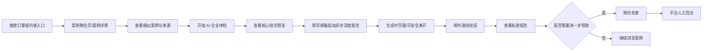

# AI案例库（AIAnLiKu）V1.0 产品需求文档

> 企业 AI 改造，从案例开始。

| 项目 | 内容 |
| --- | --- |
| 产品名称 | AI案例库（AIAnLiKu） |
| 产品定位 | 中国企业 AI 案例数据库 |
| 文档版本 | V1.0 |
| 产品作者 | Ling |
| 文档状态 | 可进入原型设计与开发 |
| 更新时间 | 2026-07 |
| 主要用户 | 中国企业老板、企业信息化负责人 |

## 1. 文档导航

| 编号 | 文档 | 说明 |
| --- | --- | --- |
| 01 | [产品总览](./01-产品总览.md) | 定位、目标、用户、范围、旅程和成功指标 |
| 02 | [前台产品需求](./02-前台产品需求.md) | 首页、案例、搜索、分类和公共页面 |
| 03 | [案例与内容治理](./03-案例与内容治理.md) | 案例模型、来源、可信度、分类及引用规范 |
| 04 | [AI 企业体检](./04-AI企业体检.md) | 问诊、报告、ROI、邮件、删除和预约专家 |
| 05 | [运营后台](./05-运营后台.md) | 登录、编辑、批量导入、审核、去重和日志 |
| 06 | [SEO、数据分析与合规](./06-SEO数据分析与合规.md) | SEO 门槛、结构化数据、埋点、隐私与内容声明 |
| 07 | [技术附录](./07-技术附录.md) | 架构、实体、接口、权限、AI 与部署边界 |
| 08 | [验收标准](./08-验收标准.md) | 功能、异常、安全、数据、SEO 和响应式验收 |
| 09 | [实施验收记录](./09-实施验收记录.md) | 当前构建证据、生产验证和外部上线门槛 |

## 2. 产品摘要

AI案例库不是通用聊天机器人、Agent 平台或开发平台，而是面向中国企业的 AI 改造案例数据库。产品通过统一整理公开案例，让企业用户能够按行业、企业规模和 AI 场景找到相似实践，理解问题、实施路径、成本、周期、效果与风险，并通过免费 AI 企业体检获得个性化改造建议。

V1.0 首发 100–200 条经人工抽查的案例，以自然搜索和内容 SEO 获取用户。第一阶段优先验证：企业用户是否愿意阅读案例、案例是否帮助用户形成改造方向、体检是否能产生高意向的专家预约。

## 3. 已确认的核心决策

1. 面向泛行业企业老板，信息化负责人为重要次级用户。
2. 案例可信度和可追溯性优先于案例总量。
3. 成功、部分达成、失败和结果未披露的案例均可收录，成功与失败同等重视。
4. 一个真实项目只形成一条案例，可关联多个信息来源。
5. 首批案例通过公开白皮书、政府材料、企业官方材料和厂商案例等整理后批量导入。
6. V1 不实现自动爬虫，但所有采集内容必须先进入统一暂存和审核流程，以便未来接入爬虫。
7. 行业分类使用带版本号的 GB/T 4754-2017《国民经济行业分类》及第 1 号修改单；前台使用易懂名称映射。
8. AI 场景采用人工维护的受控词表，AI 只能推荐，不能直接创建正式分类。
9. AI 企业体检采用结构化问诊和 V4-Flash 动态追问；先即时展示规则预览，提交邮箱后由 V4-Pro 最高强度异步生成完整版，完成时邮件通知。
10. 体检数据、报告和邮箱保存至用户主动删除；用户可通过邮件或私密报告页发起删除。
11. 专家预约由平台人工回访，手机号或微信至少填写一项。
12. MVP 部署采用 Vercel + MongoDB Atlas；中国大陆访问质量须在上线前实测。

## 4. V1.0 产品闭环

## 5. 北极星指标

前三个月北极星指标为“有效案例阅读人数”。一次有效案例阅读必须同时满足：

- 进入已发布案例详情页；
- 页面有效停留时间不少于 30 秒；
- 最大阅读深度达到页面正文的 50%；
- 同一匿名访客对同一案例在同一自然日只计一次。

辅助指标包括自然搜索访问人数、搜索成功率、案例到体检转化率、体检完成率、报告邮箱提交率、报告打开率和专家预约率。详细口径见 [SEO、数据分析与合规](./06-SEO数据分析与合规.md)。

## 6. 术语表

| 术语 | 定义 |
| --- | --- |
| 企业主体 | 实施或使用 AI 项目的企业、事业单位或组织，具有标准名称及别名 |
| 案例项目 | 某一企业在特定业务问题上实施 AI 改造的独立项目 |
| 信息来源 | 支撑案例事实的网页、白皮书、公告、年报、访谈或其他材料 |
| 原始采集记录 | 导入系统的原始文本、文件、URL、哈希及采集元数据 |
| 可信度 | 平台根据来源层级、交叉验证、完整度和一致性给出的分级判断 |
| 受控词表 | 由平台维护、具有唯一标识和同义词映射的 AI 场景分类集合 |
| 疑似重复 | 与已有案例特征或语义相似，需要管理员确认的待发布记录 |
| 体检会话 | 用户从开始问诊到生成一次企业 AI 改造报告的完整过程 |
| 私密报告链接 | 携带不可猜测访问令牌、不需要用户注册且不可被索引的报告地址 |
| 有效案例阅读 | 同时满足 30 秒停留和 50% 阅读深度的去重阅读行为 |

## 7. 文档约定

- “必须”表示上线验收的强制条件；“建议”表示不阻塞上线的优化项。
- 所有时间使用 ISO 8601 存储，前台按中国标准时间显示。
- 所有删除默认采用软删除；用户个人信息删除请求按合规流程执行不可恢复删除或匿名化。
- 所有 AI 生成内容默认是草稿，未经管理员审核不得发布为案例事实。
- 金额同时记录币种、原始值、区间和原文表述；前台不得擅自换算或补全。
- “未披露”与空值含义不同：前者表示已检查来源但来源没有公开，后者表示尚未完成整理。

## 8. 版本记录

| 版本 | 日期 | 变更说明 | 作者 |
| --- | --- | --- | --- |
| V1.0 | 2026-07 | 建立完整 MVP 产品需求、内容治理、体检、后台、技术及验收文档 | Ling / AI 协作整理 |
| V1.1 | 2026-07-19 | 完整体检报告改为 Vercel Workflow 持久异步生成，增加任务状态、恢复、邮件通知与隐私日志规则 | Ling / AI 协作整理 |

## 9. 变更管理

需求变更必须同步更新受影响文档和本页版本记录。以下变更必须在实施前完成产品确认：案例结果状态新增、可信度规则调整、SEO 收录门槛调整、体检留资时机调整、个人信息保存规则调整、去重阈值调整以及第三方 AI 服务商变更。
